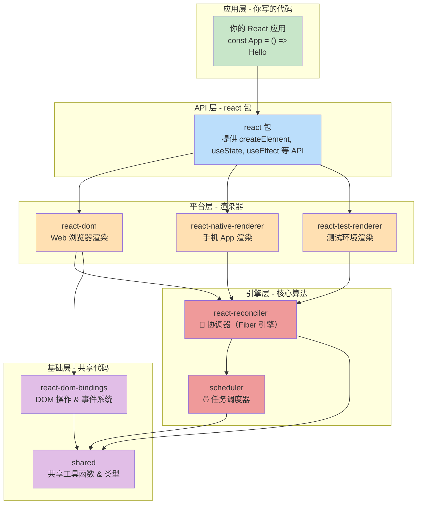
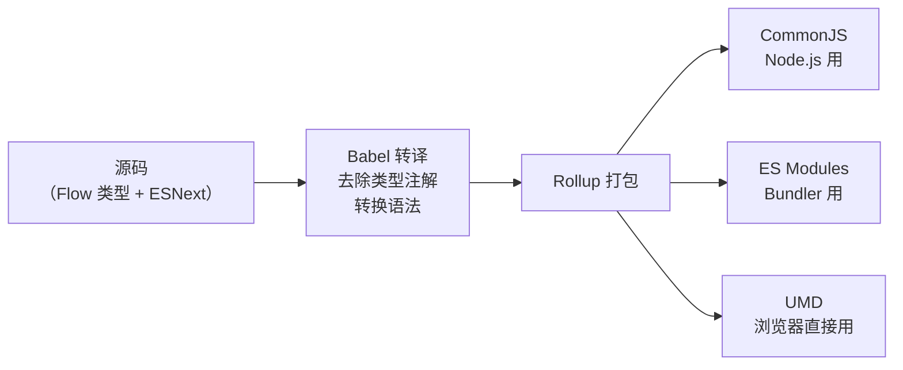
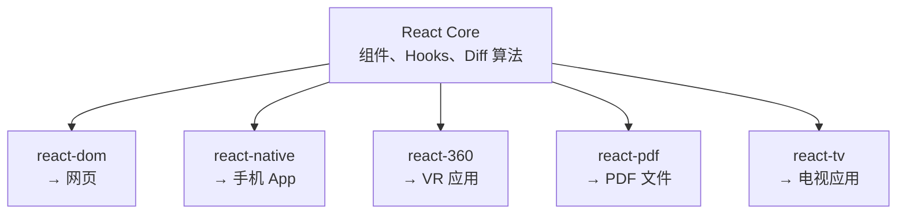
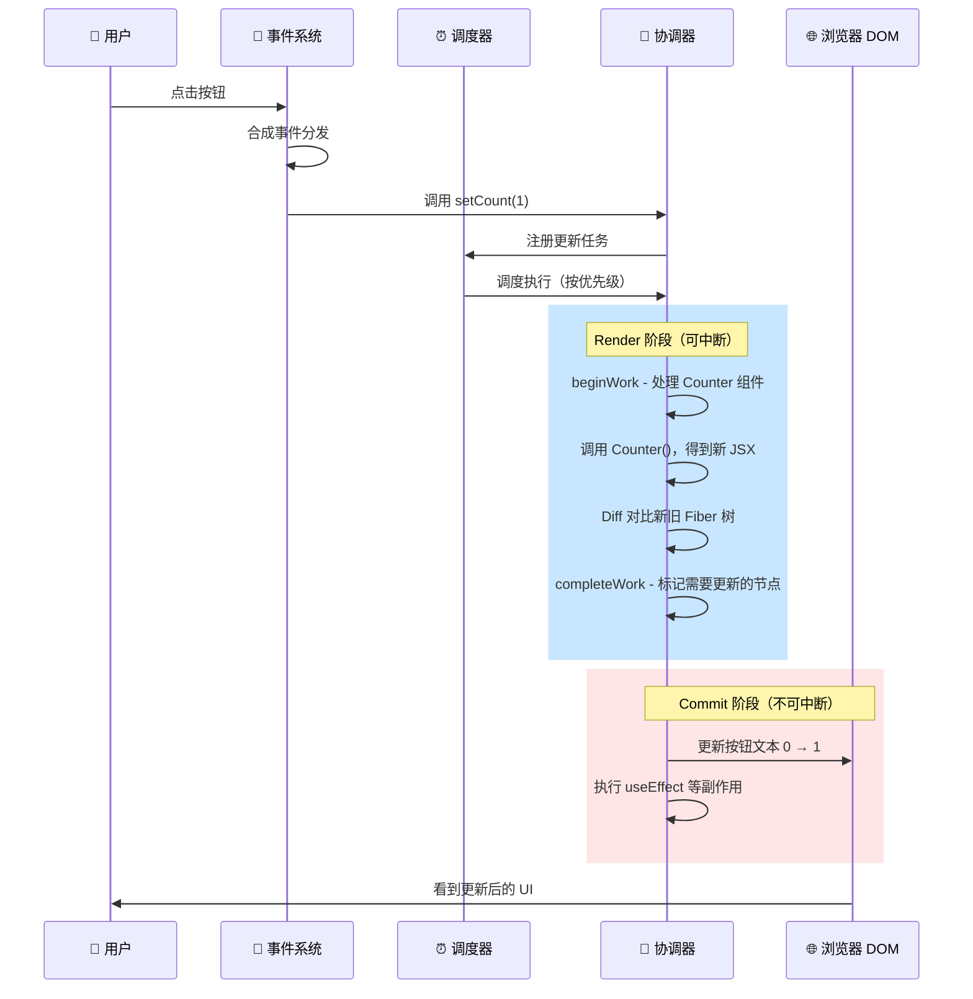

# 🏗️ 第一章：React 源码全景概览

> 在深入 React 源码之前，让我们先站在高处，俯瞰整个项目的全貌。

## 📦 这是一个什么样的项目？

React 源码仓库是一个 **Monorepo（单体仓库）**，也就是说，多个 npm 包被组织在同一个 Git 仓库中。这种方式的好处是：

- ✅ **统一版本管理**：所有包使用统一的版本号和发布流程
- ✅ **方便跨包开发**：修改一个包的接口，可以同时修改所有依赖它的包
- ✅ **共享工具链**：所有包共用同一套构建、测试和发布工具

> 🌰 **通俗比喻**：想象一个大型购物中心（Monorepo），里面有各种不同的商店（packages），它们共享购物中心的基础设施（水电、安保、停车场），但每个商店有自己独立的商品和服务。

## 📁 仓库顶层结构

```
react/
├── 📦 packages/          # 🌟 核心！所有 npm 包都在这里
├── 📜 scripts/           # 构建、测试、发布相关的脚本
├── 🔧 compiler/          # React Compiler（编译器，独立项目）
├── 🧪 fixtures/          # 测试用的示例项目
├── 📝 flow-typed/        # Flow 类型定义
├── 📄 package.json       # 项目根配置，Yarn Workspaces
├── 📄 babel.config.js    # Babel 转译配置
├── 📄 yarn.lock          # 依赖锁文件
└── 📄 ...               # 其他配置文件
```

## 🧩 核心包全览

React 仓库包含 40+ 个包，但真正的核心包只有 **6 个**。理解它们之间的关系是读懂源码的第一步。

### 🎯 核心架构分层



### 📋 六大核心包详解

| 包名 | 源码路径 | 职责 | 通俗理解 |
|------|---------|------|---------|
| `react` | `packages/react/src/` | 定义组件、Hooks 等公共 API | 📋 **菜单**：告诉你能点什么菜 |
| `react-dom` | `packages/react-dom/src/` | 将 React 组件渲染到浏览器 DOM | 🍳 **厨师**：把菜做出来端上桌 |
| `react-reconciler` | `packages/react-reconciler/src/` | Fiber 架构、Diff 算法、调度循环 | 🧠 **大脑**：决定做什么菜、先做哪道 |
| `scheduler` | `packages/scheduler/src/` | 任务优先级调度、时间切片 | ⏰ **排班表**：安排什么时候做什么 |
| `react-dom-bindings` | `packages/react-dom-bindings/src/` | 实际的 DOM 操作和事件系统 | 🔧 **工具箱**：锅碗瓢盆等厨具 |
| `shared` | `packages/shared/` | 跨包共享的工具函数和类型定义 | 📏 **标准**：统一的度量衡 |

> 🌰 **通俗比喻 - 餐厅模型**：
> - `react`（菜单）= 顾客通过菜单点菜（调 API）
> - `react-dom`（前厅服务员）= 把菜端到对应的桌子上（渲染到 DOM）
> - `react-reconciler`（后厨经理）= 统筹安排哪些菜要做、哪些可以复用
> - `scheduler`（排班调度）= 安排做菜的优先级，VIP 客人的菜先做
> - `react-dom-bindings`（厨具）= 实际炒菜、切菜的工具
> - `shared`（标准规范）= 全餐厅通用的操作手册

## 🔍 关键源码文件导航

以下是你在阅读源码时最常接触的核心文件：

### react 包
```
packages/react/src/
├── ReactClient.js          # ✨ 公共 API 导出入口
├── ReactHooks.js           # 🪝 所有 Hooks 的定义
├── ReactBaseClasses.js     # 📦 Component / PureComponent 类
├── ReactContext.js          # 🔗 createContext 实现
├── ReactLazy.js            # 💤 lazy() 懒加载实现
├── ReactMemo.js            # 📝 memo() 记忆化实现
├── ReactChildren.js        # 👶 Children 工具方法
└── jsx/
    └── ReactJSXElement.js  # 🏭 JSX 元素工厂函数
```

### react-reconciler 包（最核心最复杂）
```
packages/react-reconciler/src/
├── ReactFiber.js            # 🌳 Fiber 节点的数据结构
├── ReactFiberRoot.js        # 🏠 FiberRoot 根节点
├── ReactFiberWorkLoop.js    # 🔄 工作循环（核心调度入口）
├── ReactFiberBeginWork.js   # ▶️ Render 阶段 - 开始处理
├── ReactFiberCompleteWork.js# ✅ Render 阶段 - 完成处理
├── ReactFiberCommitWork.js  # 📤 Commit 阶段 - 提交变更
├── ReactFiberHooks.js       # 🪝 Hooks 的底层实现（5000+ 行！）
├── ReactFiberLane.js        # 🛤️ Lane 优先级模型
├── ReactChildFiber.js       # 👶 子节点 Diff 算法
└── ReactFiberReconciler.js  # 🎛️ 协调器对外接口
```

### scheduler 包
```
packages/scheduler/src/
├── forks/
│   └── Scheduler.js         # ⏰ 调度器核心实现
├── SchedulerMinHeap.js       # 📊 最小堆数据结构
└── SchedulerPriorities.js    # 🎯 优先级定义
```

### react-dom-bindings 包
```
packages/react-dom-bindings/src/
├── client/
│   ├── ReactDOMComponent.js  # 🧱 DOM 组件操作
│   └── ReactFiberConfigDOM.js# ⚙️ DOM 平台配置
├── events/
│   ├── DOMPluginEventSystem.js  # 🎯 事件委托系统
│   ├── SyntheticEvent.js        # 🔄 合成事件
│   └── ReactDOMEventListener.js # 👂 事件监听
└── server/                       # 🌐 服务端渲染相关
```

## 🔧 构建系统

React 使用 **Rollup** 作为模块打包工具，将源码编译成不同格式：



### 构建命令
```bash
# 构建所有包
yarn build

# 运行测试
yarn test

# 代码检查
yarn lint

# Flow 类型检查
yarn flow
```

### 多渠道构建

React 会为不同环境构建不同版本：

| 渠道 | 说明 | 特点 |
|------|------|------|
| `stable` | 正式发布版 | 稳定、经过充分测试 |
| `experimental` | 实验版 | 包含最新特性，可能有 Breaking Change |
| `development` | 开发版 | 包含完整的错误提示和警告 |
| `production` | 生产版 | 移除所有开发警告，代码压缩 |

> 💡 **为什么要分这么多版本？**
> - 开发版需要丰富的错误提示帮你调试，但这些提示会增加包体积
> - 生产版需要最小体积和最快速度，不需要错误提示
> - 实验版让社区提前体验新功能，收集反馈

## 🧬 React 的设计哲学

在深入源码之前，理解 React 的核心设计思想非常重要：

### 1. 声明式（Declarative）
```jsx
// ❌ 命令式：一步步告诉浏览器怎么做
const element = document.createElement('div');
element.textContent = 'Hello';
element.className = 'greeting';
document.body.appendChild(element);

// ✅ 声明式：只描述最终结果，React 帮你实现
const App = () => <div className="greeting">Hello</div>;
```

> 🌰 **比喻**：命令式就像你自己做饭，要洗菜、切菜、炒菜一步步来。声明式就像去餐厅点菜，你只需要说「来一份宫保鸡丁」，不需要关心怎么做。

### 2. 组件化（Component-Based）
```jsx
// 每个 UI 部分都是独立的组件
function Header() { return <header>...</header>; }
function Content() { return <main>...</main>; }
function App() {
  return (
    <div>
      <Header />
      <Content />
    </div>
  );
}
```

### 3. 一次学习，随处编写（Learn Once, Write Anywhere）

React 将 **核心算法（reconciler）** 与 **平台实现（renderer）** 分离：



> 💡 **为什么这样设计？** 因为 Diff 算法、调度策略这些核心逻辑跟平台无关。不管你是渲染到网页还是手机 App，「对比新旧组件树找出差异」这个过程是一样的。

## 🎯 从一次更新看完整流程

当你写下以下代码时，React 内部发生了什么？

```jsx
function Counter() {
  const [count, setCount] = useState(0);
  return <button onClick={() => setCount(count + 1)}>{count}</button>;
}
```

当用户点击按钮，触发 `setCount(count + 1)` 时：



## 📊 源码规模概览

为了让你对源码有一个直观的认识：

| 核心文件 | 代码行数 | 复杂度 |
|---------|---------|--------|
| `ReactFiberWorkLoop.js` | ~3000 行 | 🔴 极高 |
| `ReactFiberHooks.js` | ~5200 行 | 🔴 极高 |
| `ReactFiberBeginWork.js` | ~4000 行 | 🔴 极高 |
| `ReactFiberCommitWork.js` | ~3500 行 | 🟠 高 |
| `ReactFiberCompleteWork.js` | ~1500 行 | 🟠 高 |
| `ReactChildFiber.js` | ~1800 行 | 🟡 中 |
| `ReactFiber.js` | ~900 行 | 🟡 中 |
| `Scheduler.js` | ~600 行 | 🟢 中低 |
| `ReactHooks.js` | ~200 行 | 🟢 低 |

> 💡 **不要被代码量吓到！** 这些文件虽然长，但大量代码是条件分支和错误处理。核心逻辑其实并不复杂，本教程会帮你提取出核心逻辑。

---

📖 **下一章**：[JSX 与 createElement →](./02-jsx-and-createElement.md)

> 在下一章，我们将从 React 最基础的 API —— JSX 和 `createElement` 开始，理解虚拟 DOM 的诞生过程。
