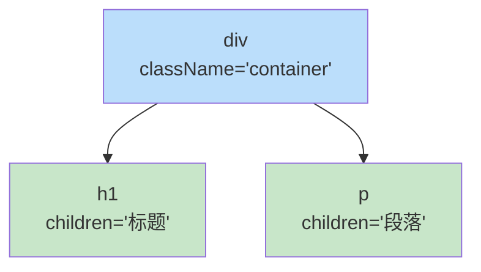
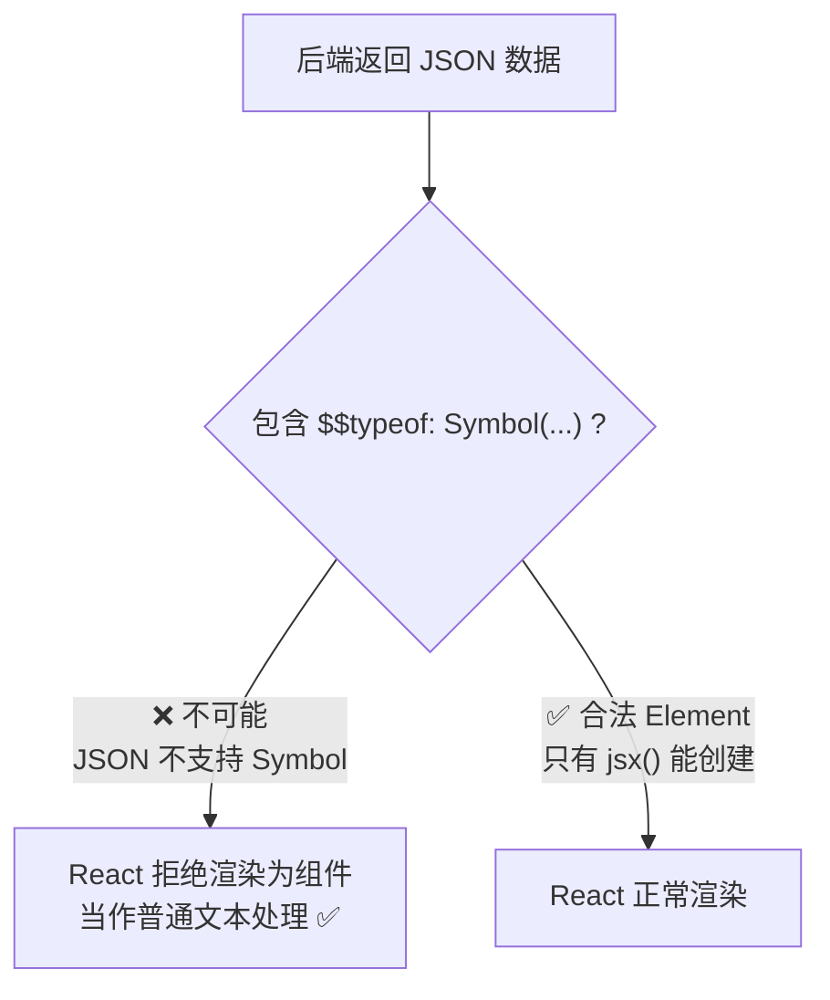
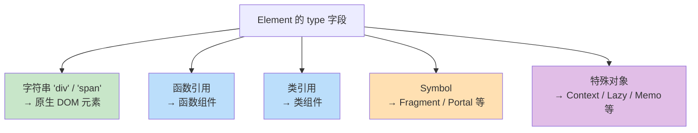
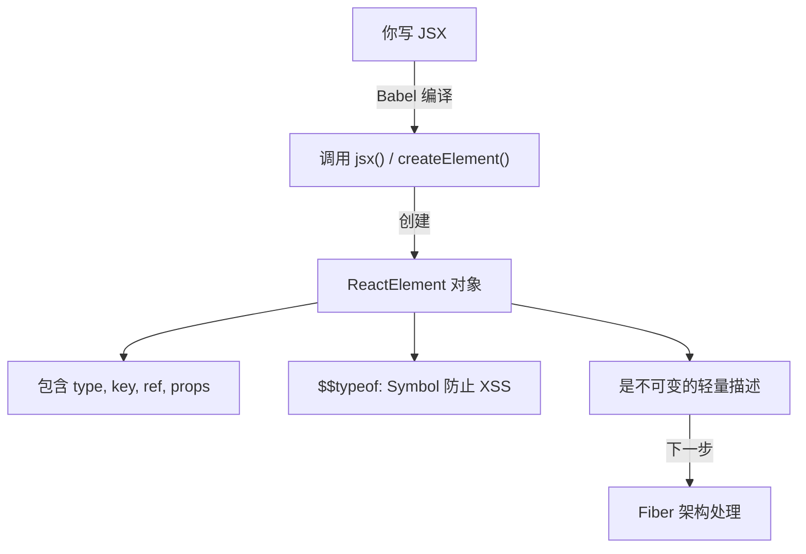

# ✨ 第二章：JSX 与 createElement

> JSX 是 React 的「语法糖」，本章带你理解 JSX 是如何变成 JavaScript 对象的。

## 🤔 什么是 JSX？

你写的这行代码：

```jsx
const element = <h1 className="title">Hello, React!</h1>;
```

**其实并不是合法的 JavaScript**。浏览器根本不认识 `<h1>` 这种写法。那它是怎么工作的呢？

答案是：**编译转换**。在代码运行之前，Babel（或其他编译器）会将 JSX 转换为普通的 JavaScript 函数调用。

## 🔄 JSX 的编译过程

```mermaid
graph LR
    JSX["JSX 语法<br/>&lt;h1 className='title'&gt;Hello&lt;/h1&gt;"] 
    -->|"Babel 编译"| 
    JS["JavaScript<br/>jsx('h1', {className: 'title', children: 'Hello'})"]
    -->|"运行时执行"| 
    OBJ["React Element 对象<br/>{type: 'h1', props: {...}, ...}"]
```

### 新版 JSX 转换（React 17+）

在 React 17 之前，JSX 会被编译为 `React.createElement()` 调用，所以你必须在每个文件中 `import React`。

从 React 17 开始，使用**新的 JSX 转换**，不再需要手动导入 React：

```jsx
// 你写的代码
function App() {
  return <h1 className="title">Hello</h1>;
}

// ⬇️ Babel 编译后（新版转换）
import { jsx as _jsx } from 'react/jsx-runtime';

function App() {
  return _jsx('h1', { className: 'title', children: 'Hello' });
}
```

> 📂 **源码位置**：`packages/react/src/jsx/ReactJSXElement.js`

## 🏭 深入 jsx() 函数

让我们看看 `jsx()` 函数做了什么。以下是简化后的核心逻辑：

```javascript
// 简化自 packages/react/src/jsx/ReactJSXElement.js

function jsx(type, config, maybeKey) {
  let key = null;
  let ref = null;
  let props = {};

  // 1️⃣ 提取 key
  if (maybeKey !== undefined) {
    key = '' + maybeKey;
  }

  // 2️⃣ 提取 ref 和其他 props
  for (const propName in config) {
    if (propName === 'ref') {
      ref = config.ref;
    } else {
      props[propName] = config[propName];
    }
  }

  // 3️⃣ 处理 defaultProps（Class 组件）
  if (type && type.defaultProps) {
    const defaultProps = type.defaultProps;
    for (const propName in defaultProps) {
      if (props[propName] === undefined) {
        props[propName] = defaultProps[propName];
      }
    }
  }

  // 4️⃣ 创建并返回 ReactElement 对象
  return ReactElement(type, key, ref, undefined, undefined, props);
}
```

## 📦 ReactElement —— 虚拟 DOM 的最小单元

`jsx()` 最终创建的是一个 **ReactElement 对象**，这就是我们常说的「虚拟 DOM 节点」：

```javascript
// 简化自 packages/react/src/jsx/ReactJSXElement.js

function ReactElement(type, key, ref, owner, props) {
  const element = {
    // 🏷️ 标识这是一个 React Element
    $$typeof: REACT_ELEMENT_TYPE,  // Symbol(react.transitional.element)

    // 📋 元素类型：'div', 'span' 或函数组件、类组件
    type: type,

    // 🔑 用于列表 Diff 的唯一标识
    key: key,

    // 🔗 引用（获取 DOM 节点或组件实例）
    ref: ref,

    // 📦 属性集合（包含 children）
    props: props,
  };

  return element;
}
```

> 🌰 **通俗理解**：ReactElement 就像一份**建筑设计图纸**。它描述了「要建什么（type）」「建筑参数（props）」「编号（key）」，但它本身不是建筑物（DOM）。React 会根据这份图纸来决定如何操作真实的 DOM。

### 实际例子

```jsx
// 这段 JSX
<div className="container">
  <h1>标题</h1>
  <p>段落</p>
</div>

// 会生成这样的 ReactElement 树
{
  $$typeof: Symbol(react.transitional.element),
  type: 'div',
  key: null,
  ref: null,
  props: {
    className: 'container',
    children: [
      {
        $$typeof: Symbol(react.transitional.element),
        type: 'h1',
        props: { children: '标题' }
      },
      {
        $$typeof: Symbol(react.transitional.element),
        type: 'p',
        props: { children: '段落' }
      }
    ]
  }
}
```



## 🔒 $$typeof 的安全作用

你可能注意到了 `$$typeof: Symbol(react.transitional.element)` 这个字段。它的作用是**防止 XSS 攻击**。

### 攻击场景

假设你的应用从后端 API 获取数据并渲染：

```jsx
// ⚠️ 如果后端返回了一个伪造的 React Element 对象
const maliciousData = {
  type: 'div',
  props: {
    dangerouslySetInnerHTML: {
      __html: '<script>alert("被攻击了！")</script>'
    }
  }
};

// 如果 React 直接渲染这个对象...
return <div>{maliciousData}</div>;  // 会执行恶意脚本吗？
```

### 防御原理

**不会！** 因为 React 会检查 `$$typeof` 字段：

```javascript
// React 内部会检查
if (element.$$typeof !== REACT_ELEMENT_TYPE) {
  // 不是合法的 React Element，当作普通文本渲染
}
```

而 `REACT_ELEMENT_TYPE` 是一个 **Symbol**：

```javascript
// packages/shared/ReactSymbols.js
const REACT_ELEMENT_TYPE = Symbol.for('react.transitional.element');
```

> 💡 **为什么 Symbol 能防御？** 因为 `JSON.parse()` 无法解析 Symbol 类型。后端返回的 JSON 数据中不可能包含 Symbol，所以伪造的对象无法拥有正确的 `$$typeof`。



## 🧩 不同类型的 Element

JSX 中的 `type` 字段可以是多种值：

```jsx
// 1️⃣ 原生 HTML 标签 → type 是字符串
<div />         // type: 'div'
<span />        // type: 'span'

// 2️⃣ 函数组件 → type 是函数
function Hello() { return <div>Hi</div>; }
<Hello />       // type: Hello（函数引用）

// 3️⃣ 类组件 → type 是类
class Hello extends React.Component { ... }
<Hello />       // type: Hello（类引用）

// 4️⃣ Fragment → type 是 Symbol
<>...</>        // type: Symbol(react.fragment)

// 5️⃣ Context Provider
<MyContext.Provider>  // type: { $$typeof: REACT_PROVIDER_TYPE, ... }

// 6️⃣ lazy 组件
const LazyComp = React.lazy(() => import('./Heavy'));
<LazyComp />    // type: { $$typeof: REACT_LAZY_TYPE, _payload: ... }
```



## 🌲 从 Element 到 Fiber

ReactElement 是**轻量级、不可变**的描述对象。但 React 需要在后续的渲染过程中跟踪状态、比较差异等，这些操作需要**更丰富的数据结构** —— 这就是下一章要讲的 **Fiber 节点**。

```mermaid
graph LR
    JSX["JSX<br/>声明式描述"] 
    -->|"编译"| 
    EL["ReactElement<br/>轻量描述对象"]
    -->|"首次渲染时<br/>创建"| 
    FIBER["Fiber 节点<br/>可变工作单元"]
    -->|"Commit 阶段<br/>映射"| 
    DOM["真实 DOM"]
```

> 🌰 **比喻演进**：
> - **JSX** = 你说的话（「我要一杯拿铁」）
> - **ReactElement** = 写在订单纸上的内容（轻量、不可改）
> - **Fiber** = 咖啡师的工作台（标记做到哪一步了、用了什么原料）
> - **DOM** = 最终做好的那杯咖啡

## 🔑 createElement vs jsx

你可能在旧代码中见过 `React.createElement`，它和 `jsx` 有什么区别？

```javascript
// React.createElement（旧版转换）
React.createElement('div', { className: 'app' }, 
  React.createElement('h1', null, 'Hello')
);

// jsx（新版转换）
import { jsx } from 'react/jsx-runtime';
jsx('div', { 
  className: 'app', 
  children: jsx('h1', { children: 'Hello' }) 
});
```

| 特性 | `createElement` | `jsx` |
|------|-----------------|-------|
| 需要导入 React | ✅ 是 | ❌ 否（自动注入） |
| children 传递方式 | 作为第 3+ 个参数 | 放在 props.children 中 |
| key 传递方式 | 放在 props 中 | 作为单独的第 3 个参数 |
| 开发环境检查 | 运行时检查 | 有专门的 `jsxDEV` 函数 |

> 📂 **源码位置**：
> - `createElement`：`packages/react/src/jsx/ReactJSXElement.js` 中的 `createElement` 函数
> - `jsx`：同一文件中的 `jsx` 函数
> - `jsxDEV`：开发模式下使用，包含额外的 props 验证和警告

## 📝 本章小结



**核心要点**：
1. 🔄 JSX 是语法糖，会被编译为 `jsx()` 函数调用
2. 📦 `jsx()` 创建 ReactElement 对象（虚拟 DOM 节点）
3. 🔒 `$$typeof: Symbol` 机制防止 XSS 攻击
4. 📋 ReactElement 是轻量、不可变的 UI 描述
5. 🌉 ReactElement 是连接「你的代码」和「React 内部引擎」的桥梁

---

📖 **下一章**：[Fiber 架构深度解析 →](./03-fiber-architecture.md)

> 在下一章，我们将深入 React 最核心的数据结构 —— Fiber，理解它为什么被称为 React 的「心脏」。
