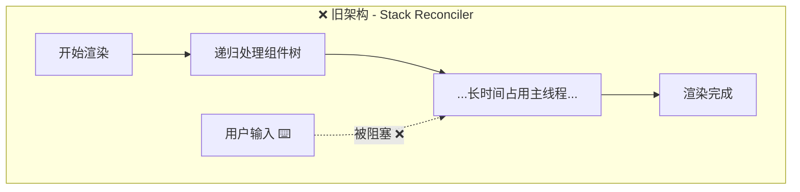
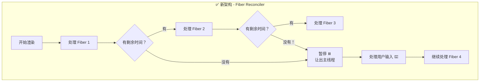
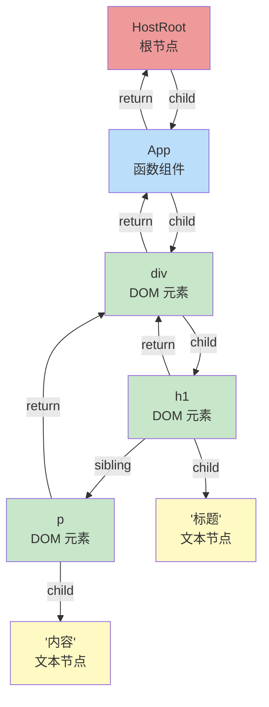
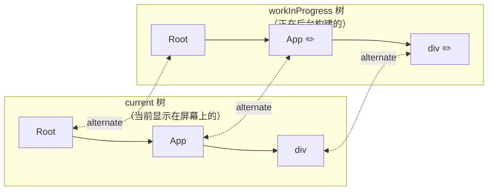
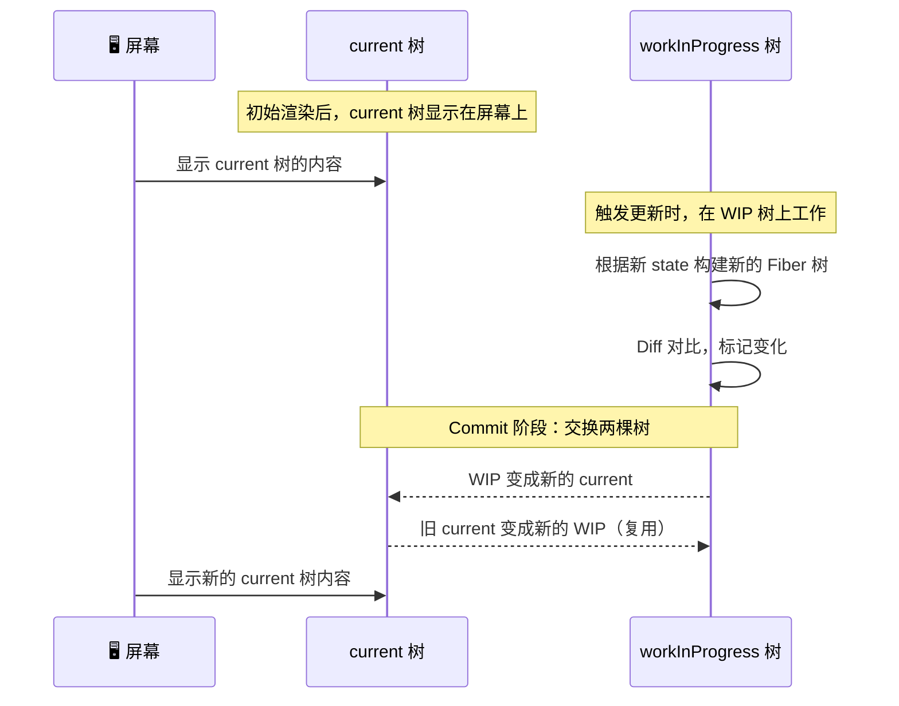
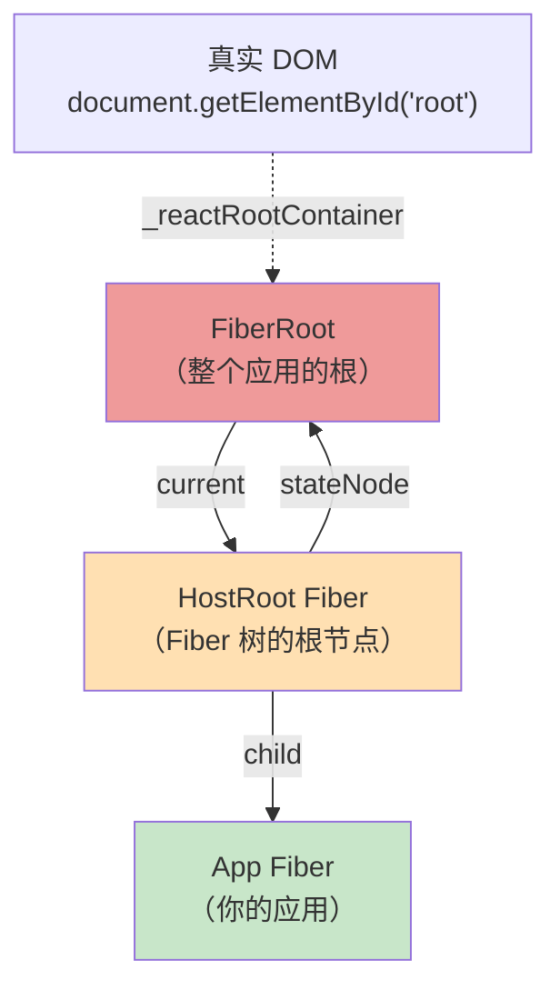
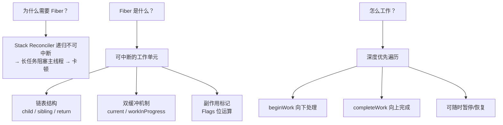

# 🌳 第三章：Fiber 架构深度解析

> Fiber 是 React 16+ 引入的全新架构，也是理解 React 内部工作原理的**关键钥匙**。

## 🤔 为什么需要 Fiber？

### 旧架构的问题（React 15 Stack Reconciler）

在 React 15 及之前，React 使用的是**递归的 Stack Reconciler（栈协调器）**：

```javascript
// 伪代码 - 旧版递归渲染
function render(element) {
  if (typeof element.type === 'string') {
    // 原生 DOM 节点
    const dom = document.createElement(element.type);
    element.props.children.forEach(child => {
      dom.appendChild(render(child));  // ⚠️ 递归！无法中断！
    });
    return dom;
  }
}
```

> 🌰 **问题比喻**：想象你在给一本 1000 页的书做索引。旧方式是**一口气从头到尾翻完**，中间不能停。如果这时候有人叫你接电话（用户输入），你只能说「等我翻完再说」—— 这就是**卡顿**的原因。



### Fiber 架构的解决方案

Fiber 将**递归**改为**可中断的循环**：



> 🌰 **比喻**：Fiber 就像把一本大书拆成一页页的便利贴。你可以翻几页，然后去接个电话，回来后从上次的便利贴继续翻 —— **可以随时暂停和恢复**。

## 📊 Fiber 节点的数据结构

每一个 React 组件/DOM 元素都会对应一个 **Fiber 节点**。让我们看看它包含哪些信息：

> 📂 **源码位置**：`packages/react-reconciler/src/ReactFiber.js`

```javascript
// 简化的 Fiber 节点结构
function FiberNode(tag, pendingProps, key, mode) {
  // ========== 🏷️ 身份标识 ==========
  this.tag = tag;              // 节点类型标记（函数组件、类组件、DOM 元素等）
  this.key = key;              // 列表 Diff 用的唯一标识
  this.elementType = null;     // 元素类型（和 ReactElement.type 对应）
  this.type = null;            // 组件函数 / 类 / DOM 标签名

  // ========== 🌲 树结构指针 ==========
  this.return = null;          // 父节点
  this.child = null;           // 第一个子节点
  this.sibling = null;         // 下一个兄弟节点
  this.index = 0;              // 在兄弟中的位置

  // ========== 📦 数据存储 ==========
  this.ref = null;             // ref 引用
  this.pendingProps = pendingProps; // 新的 props（待处理）
  this.memoizedProps = null;   // 上次渲染用的 props
  this.memoizedState = null;   // 上次渲染的 state（Hooks 链表也存在这里！）
  this.updateQueue = null;     // 更新队列

  // ========== ⚡ 副作用 ==========
  this.flags = NoFlags;        // 副作用标记（增/删/改）
  this.subtreeFlags = NoFlags; // 子树的副作用标记
  this.deletions = null;       // 待删除的子节点

  // ========== 🛤️ 调度优先级 ==========
  this.lanes = NoLanes;        // 本节点的优先级
  this.childLanes = NoLanes;   // 子树的优先级

  // ========== 🔄 双缓冲 ==========
  this.alternate = null;       // 指向另一棵树中对应的 Fiber
  
  // ========== 🖥️ DOM 引用 ==========
  this.stateNode = null;       // 对应的真实 DOM 节点或类组件实例
}
```

### 🏷️ Fiber Tag 类型

`tag` 字段标识了 Fiber 节点的类型：

```javascript
// 简化自 packages/react-reconciler/src/ReactWorkTags.js

const FunctionComponent = 0;     // 函数组件
const ClassComponent = 1;        // 类组件
const HostRoot = 3;              // 根节点
const HostComponent = 5;         // DOM 元素（div, span 等）
const HostText = 6;              // 文本节点
const Fragment = 7;              // Fragment
const ContextProvider = 10;      // Context.Provider
const ForwardRef = 11;           // forwardRef 组件
const MemoComponent = 14;        // memo 组件
const SimpleMemoComponent = 15;  // 简单 memo 组件
const LazyComponent = 16;        // lazy 组件
const SuspenseComponent = 13;    // Suspense 组件
```

## 🌲 Fiber 树的链表结构

不同于传统的树结构（父节点持有子节点数组），Fiber 使用**链表**连接节点：



对应的 JSX：
```jsx
function App() {
  return (
    <div>
      <h1>标题</h1>
      <p>内容</p>
    </div>
  );
}
```

### 为什么用链表而不是数组？

```javascript
// ❌ 数组方式
fiber.children = [child1, child2, child3]; // 遍历简单，但中断后难以恢复位置

// ✅ 链表方式
fiber.child = child1;          // 第一个孩子
child1.sibling = child2;      // 下一个兄弟
child2.sibling = child3;      // 再下一个
child1.return = fiber;         // 回到父节点
```

> 🌰 **比喻**：想象你在逛商场。数组方式就像拿着整层楼的商店列表，你必须记住「我逛到第几个了」。链表方式就像每个商店门口都有箭头告诉你「下一个商店在哪」「回电梯在哪」—— 你随时可以停下来，下次从当前位置继续走。

## 🔄 双缓冲机制（Double Buffering）

这是 Fiber 架构最精巧的设计之一。React 同时维护**两棵 Fiber 树**：



### 工作流程



> 🌰 **通俗比喻 - 画画**：
> 想象一个画家有**两块画板**。画板 A 上是展示给观众的画（current），画板 B 在后台悄悄画新画（workInProgress）。画好后，把画板 B 翻到前面展示，画板 A 翻到后面重新利用。观众永远看到的是完整的画面，不会看到画到一半的草稿 —— 这就是**双缓冲**。

### 为什么需要双缓冲？

1. **避免 UI 闪烁**：在后台完成所有计算后，一次性提交到屏幕
2. **复用节点**：旧的 Fiber 节点不丢弃，可以在下次更新中复用
3. **支持中断恢复**：如果 workInProgress 树构建到一半被中断，不会影响当前显示

```javascript
// 源码中的切换逻辑
// packages/react-reconciler/src/ReactFiberWorkLoop.js

function commitRoot(root) {
  // ...提交所有变更到 DOM 后...
  
  // 🔄 关键！交换 current 指针
  root.current = finishedWork;  // workInProgress 树变成 current 树
}
```

## 🏗️ Fiber 树的构建过程

当 React 首次渲染或更新时，会通过**深度优先遍历**构建 Fiber 树：

```mermaid
graph TD
    subgraph "遍历顺序"
        R["1⃣ Root<br/>beginWork"]
        A["2⃣ App<br/>beginWork"]
        D["3⃣ div<br/>beginWork"]
        H["4⃣ h1<br/>beginWork"]
        T1["5⃣ 'Hello'<br/>beginWork"]
        T1C["6⃣ 'Hello'<br/>completeWork ✅"]
        HC["7⃣ h1<br/>completeWork ✅"]
        P["8⃣ p<br/>beginWork"]
        T2["9⃣ '内容'<br/>beginWork"]
        T2C["🔟 '内容'<br/>completeWork ✅"]
        PC["1⃣1⃣ p<br/>completeWork ✅"]
        DC["1⃣2⃣ div<br/>completeWork ✅"]
        AC["1⃣3⃣ App<br/>completeWork ✅"]
        RC["1⃣4⃣ Root<br/>completeWork ✅"]
    end

    R --> A --> D --> H --> T1 --> T1C --> HC --> P --> T2 --> T2C --> PC --> DC --> AC --> RC
```



遍历规则：
1. **向下**：从当前节点到第一个**子节点**（`child`），调用 `beginWork`
2. **向右**：如果没有子节点，移到**兄弟节点**（`sibling`），回到步骤 1
3. **向上**：如果没有兄弟节点，回到**父节点**（`return`），调用 `completeWork`

```javascript
// 简化的工作循环 - packages/react-reconciler/src/ReactFiberWorkLoop.js

function workLoopSync() {
  while (workInProgress !== null) {
    performUnitOfWork(workInProgress);
  }
}

function performUnitOfWork(unitOfWork) {
  const current = unitOfWork.alternate;
  
  // 1. beginWork：处理当前节点，返回子节点
  const next = beginWork(current, unitOfWork, renderLanes);
  
  if (next === null) {
    // 2. 没有子节点了，完成当前节点
    completeUnitOfWork(unitOfWork);
  } else {
    // 3. 有子节点，继续向下
    workInProgress = next;
  }
}

function completeUnitOfWork(unitOfWork) {
  let completedWork = unitOfWork;
  do {
    // 完成当前节点
    completeWork(completedWork.alternate, completedWork, renderLanes);
    
    // 有兄弟节点？处理兄弟
    const siblingFiber = completedWork.sibling;
    if (siblingFiber !== null) {
      workInProgress = siblingFiber;
      return;
    }
    
    // 没有兄弟，回到父节点
    completedWork = completedWork.return;
    workInProgress = completedWork;
  } while (completedWork !== null);
}
```

## ⚡ Fiber 的副作用标记（Flags）

在遍历过程中，React 会给需要执行 DOM 操作的 Fiber 打上**标记**：

```javascript
// 简化自 packages/react-reconciler/src/ReactFiberFlags.js

const NoFlags =    0b00000000000000000000000000;  // 无操作
const Placement =  0b00000000000000000000000010;  // 插入新节点
const Update =     0b00000000000000000000000100;  // 更新节点
const Deletion =   0b00000000000000000000001000;  // 删除节点
const ChildDeletion = 0b00000000000000000000010000; // 删除子节点
const Ref =        0b00000000000000001000000000;  // Ref 变化
const Passive =    0b00000000000000100000000000;  // 有 useEffect
```

> 💡 **为什么用二进制位（Bitmask）？** 因为一个节点可能同时有多个标记，位运算可以高效地组合和检查：

```javascript
// 同时标记「更新」和「有 useEffect」
fiber.flags = Update | Passive;  // 0b100 | 0b100000000000 = 0b100000000100

// 检查是否需要更新
if (fiber.flags & Update) { /* 需要更新 */ }

// 检查是否有 useEffect
if (fiber.flags & Passive) { /* 有 useEffect */ }
```

> 🌰 **比喻**：就像快递包裹上的贴纸。一个包裹可以同时贴「易碎品」和「加急」两个贴纸。快递员看到贴纸就知道要怎么处理，不需要打开包裹检查。

## 🏠 FiberRoot vs HostRoot

React 应用有两个重要的根节点概念：

```javascript
// 你的代码
const root = ReactDOM.createRoot(document.getElementById('root'));
root.render(<App />);
```



```javascript
// packages/react-reconciler/src/ReactFiberRoot.js

function FiberRootNode(containerInfo, tag) {
  this.containerInfo = containerInfo;  // DOM 容器（#root）
  this.current = null;                 // 指向 HostRoot Fiber
  this.finishedWork = null;            // 已完成的 workInProgress 树
  this.pendingLanes = NoLanes;         // 待处理的优先级
  this.callbackNode = null;            // 调度器的回调
  // ...
}
```

## 📝 本章小结



**核心要点**：
1. 🎯 Fiber 解决了旧架构无法中断渲染的问题
2. 🌲 每个组件对应一个 Fiber 节点，通过链表（child/sibling/return）连接
3. 🔄 双缓冲（current + workInProgress）保证 UI 更新的一致性
4. 🏗️ 通过深度优先遍历构建 Fiber 树（beginWork → completeWork）
5. ⚡ 使用位运算标记副作用，高效定位需要操作的节点

---

📖 **下一章**：[协调算法（Reconciliation）→](./04-reconciliation.md)

> 在下一章，我们将深入 Diff 算法，看看 React 是如何高效地找出两棵树的差异的。
