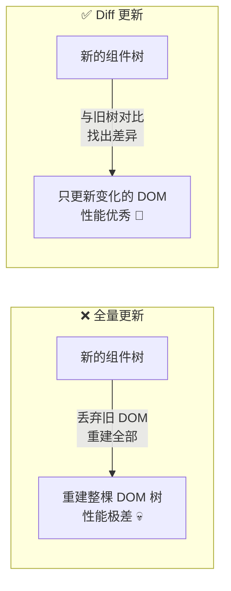
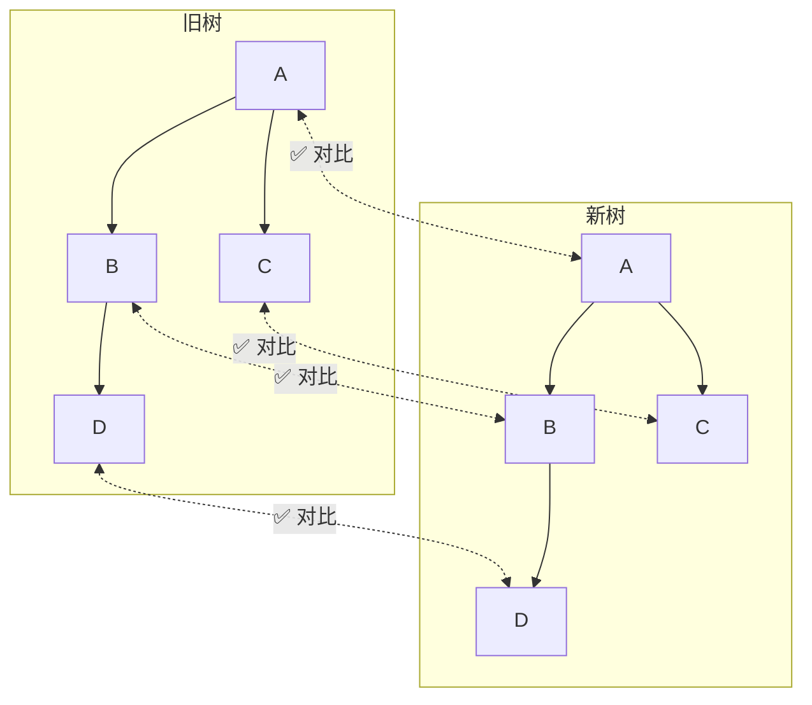
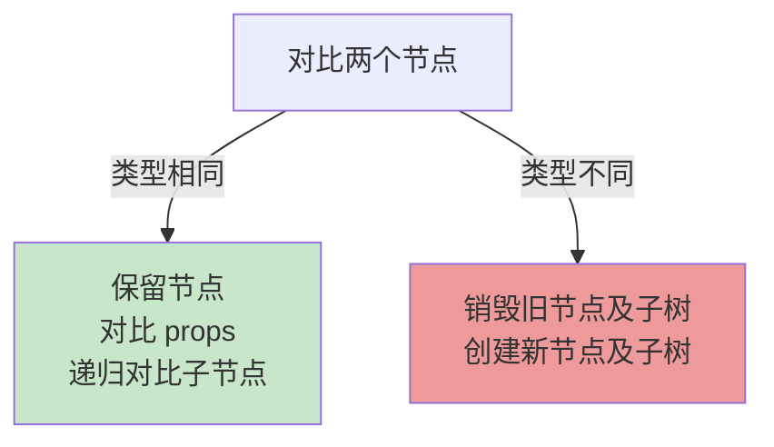
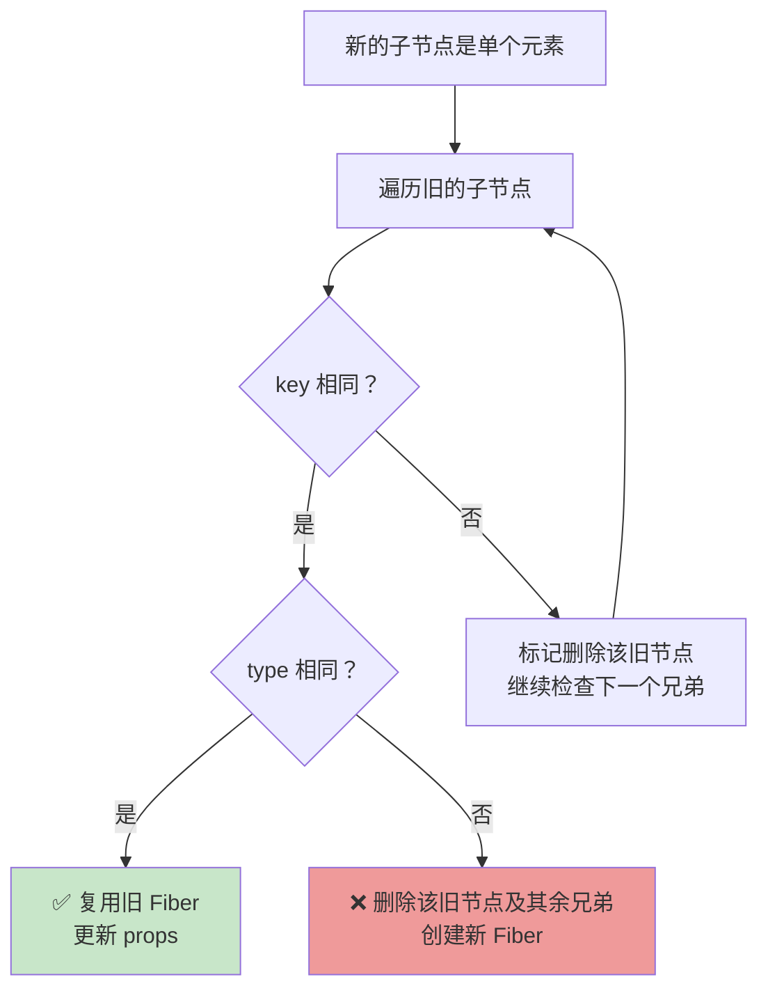
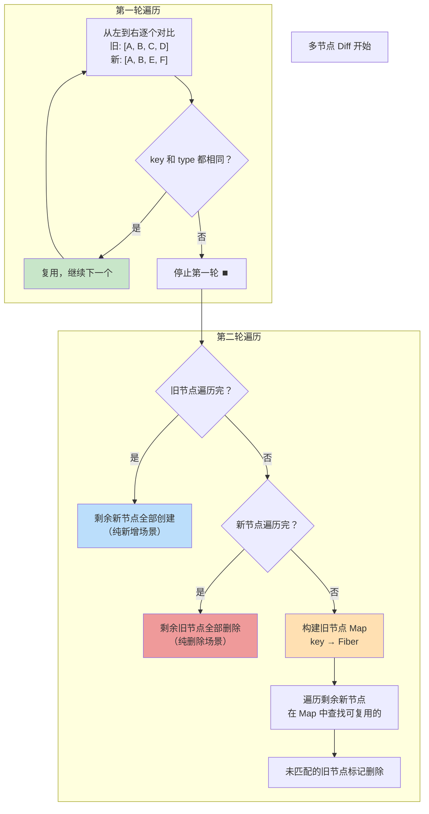
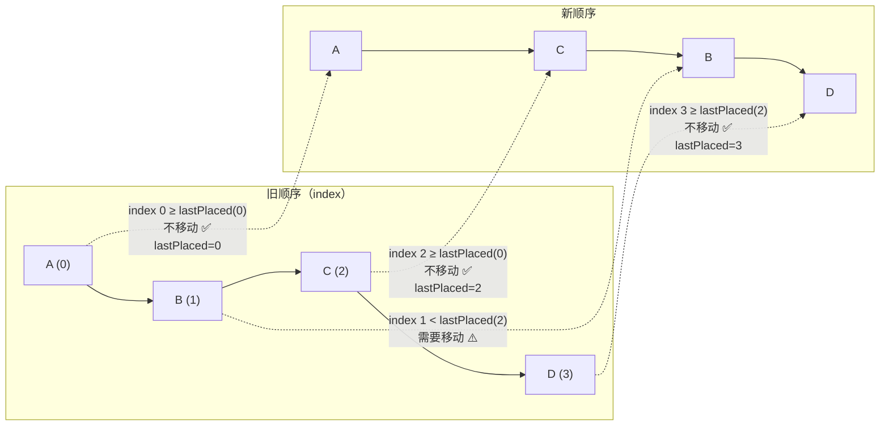
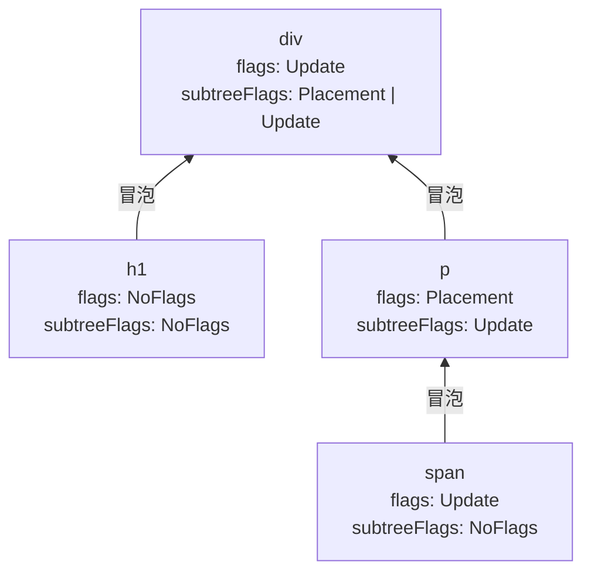
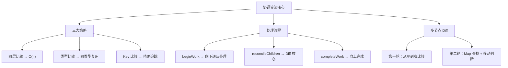

# 🔄 第四章：协调算法（Reconciliation）

> 协调（Reconciliation）是 React 的核心算法，负责对比新旧组件树，找出最小变化集合。

## 🤔 什么是协调？

当你的组件状态改变时，React 需要：
1. 根据新的 state 和 props，生成新的 ReactElement 树
2. 对比新旧两棵树，找出**最小的差异**
3. 只更新变化了的部分

这个「对比差异」的过程就叫**协调（Reconciliation）**，其中的对比算法就是我们常说的 **Diff 算法**。

> 🌰 **通俗比喻**：想象你有两张「找不同」的图片。React 的 Diff 算法就是帮你快速找出哪些地方不一样，然后只修改那些不同的地方，而不是整张图重新画。

## ⚡ 为什么不直接全量更新？



完整对比两棵树的最优算法时间复杂度是 **O(n³)**，对于 1000 个节点的树需要 10 亿次比较。React 通过三个策略将复杂度降为 **O(n)**：

## 📐 Diff 的三大策略

### 策略一：同层比较（Tree Diff）

> React 只对比**同一层级**的节点，不会跨层移动。



> 💡 **为什么只同层比较？** 在实际的 Web 应用中，跨层级移动 DOM 节点的情况极少发生。React 选择了实用主义：牺牲理论最优解，换取实际性能的大幅提升。

### 策略二：类型比较（Component Diff）

> 类型不同的元素 → 直接销毁重建；类型相同 → 保留节点，只更新属性。

```jsx
// 情况 1：类型相同 → 更新属性
// 旧：<div className="old">Hello</div>
// 新：<div className="new">World</div>
// 结果：保留 div 节点，更新 className 和文本

// 情况 2：类型不同 → 销毁重建
// 旧：<div>Hello</div>
// 新：<span>Hello</span>
// 结果：销毁 div 及其子树，创建新的 span
```



### 策略三：Key 标识（Element Diff）

> 同一层级的子节点通过 `key` 来标识「谁是谁」。

```jsx
// ❌ 没有 key：React 不知道哪个是哪个
<ul>
  <li>苹果</li>    {/* index 0 */}
  <li>香蕉</li>    {/* index 1 */}
  <li>橘子</li>    {/* index 2 */}
</ul>

// ✅ 有 key：React 能精确追踪每个元素
<ul>
  <li key="apple">苹果</li>
  <li key="banana">香蕉</li>
  <li key="orange">橘子</li>
</ul>
```

## 🔍 深入 beginWork —— Diff 的入口

> 📂 **源码位置**：`packages/react-reconciler/src/ReactFiberBeginWork.js`

`beginWork` 是 Render 阶段的核心函数，根据 Fiber 节点的类型（tag）分发到不同的处理逻辑：

```javascript
// 简化的 beginWork
function beginWork(current, workInProgress, renderLanes) {
  // current !== null 表示这是更新（不是首次渲染）
  if (current !== null) {
    const oldProps = current.memoizedProps;
    const newProps = workInProgress.pendingProps;
    
    // 🚀 优化：如果 props 和 type 都没变，可以跳过
    if (oldProps === newProps && !hasContextChanged()) {
      return bailoutOnAlreadyFinishedWork(current, workInProgress, renderLanes);
    }
  }

  // 根据节点类型分发
  switch (workInProgress.tag) {
    case FunctionComponent:
      return updateFunctionComponent(current, workInProgress, renderLanes);
    case ClassComponent:
      return updateClassComponent(current, workInProgress, renderLanes);
    case HostComponent:  // DOM 元素如 div, span
      return updateHostComponent(current, workInProgress, renderLanes);
    case HostText:       // 文本节点
      return updateHostText(current, workInProgress);
    case Fragment:
      return updateFragment(current, workInProgress, renderLanes);
    case ContextProvider:
      return updateContextProvider(current, workInProgress, renderLanes);
    case SuspenseComponent:
      return updateSuspenseComponent(current, workInProgress, renderLanes);
    // ...更多类型
  }
}
```

### 函数组件的处理

```javascript
function updateFunctionComponent(current, workInProgress, renderLanes) {
  // 1. 调用组件函数，执行 Hooks
  const nextChildren = renderWithHooks(
    current,
    workInProgress,
    Component,
    nextProps,
    context,
    renderLanes
  );
  
  // 2. 如果组件没有变化，可以复用（bailout 优化）
  if (current !== null && !didReceiveUpdate) {
    bailoutHooks(current, workInProgress, renderLanes);
    return bailoutOnAlreadyFinishedWork(current, workInProgress, renderLanes);
  }
  
  // 3. 协调子节点（Diff 的核心）
  reconcileChildren(current, workInProgress, nextChildren, renderLanes);
  
  return workInProgress.child;
}
```

## 👶 子节点 Diff —— reconcileChildFibers

> 📂 **源码位置**：`packages/react-reconciler/src/ReactChildFiber.js`

这是 Diff 算法最核心的部分，处理子节点的增删改：

```javascript
function reconcileChildFibers(returnFiber, currentFirstChild, newChild, lanes) {
  // 根据新子节点的类型，走不同的 Diff 路径
  
  // 1️⃣ 新子节点是对象（单个元素）
  if (typeof newChild === 'object' && newChild !== null) {
    switch (newChild.$$typeof) {
      case REACT_ELEMENT_TYPE:
        return reconcileSingleElement(returnFiber, currentFirstChild, newChild, lanes);
      case REACT_PORTAL_TYPE:
        return reconcileSinglePortal(returnFiber, currentFirstChild, newChild, lanes);
      case REACT_LAZY_TYPE:
        // 处理 lazy 组件
    }
    
    // 新子节点是数组（多个元素）
    if (isArray(newChild)) {
      return reconcileChildrenArray(returnFiber, currentFirstChild, newChild, lanes);
    }
  }
  
  // 2️⃣ 新子节点是文本
  if (typeof newChild === 'string' || typeof newChild === 'number') {
    return reconcileSingleTextNode(returnFiber, currentFirstChild, '' + newChild, lanes);
  }
  
  // 3️⃣ 新子节点为空 → 删除所有旧子节点
  return deleteRemainingChildren(returnFiber, currentFirstChild);
}
```

### 单节点 Diff（reconcileSingleElement）

当新的子节点只有一个元素时：



```javascript
function reconcileSingleElement(returnFiber, currentFirstChild, element, lanes) {
  const key = element.key;
  let child = currentFirstChild;
  
  // 遍历旧的子节点链表
  while (child !== null) {
    if (child.key === key) {
      // key 相同
      if (child.elementType === element.type) {
        // type 也相同 → 复用！
        deleteRemainingChildren(returnFiber, child.sibling); // 删除多余兄弟
        const existing = useFiber(child, element.props);      // 复用 Fiber
        existing.return = returnFiber;
        return existing;
      } else {
        // key 相同但 type 不同 → 不可能复用任何节点
        deleteRemainingChildren(returnFiber, child);
        break;
      }
    } else {
      // key 不同 → 标记删除，继续看下一个兄弟
      deleteChild(returnFiber, child);
    }
    child = child.sibling;
  }
  
  // 没有可复用的 → 创建新 Fiber
  const created = createFiberFromElement(element, returnFiber.mode, lanes);
  created.return = returnFiber;
  return created;
}
```

### 多节点 Diff（reconcileChildrenArray）—— 最复杂的部分

当新的子节点是数组时（列表渲染），需要处理：**节点更新、新增、删除、移动**。

React 使用**两轮遍历**来高效处理：



#### 用具体例子理解

**场景 1：节点更新（最常见）**
```
旧: A → B → C → D
新: A → B → C → D  （props 变了）

第一轮：A✅ B✅ C✅ D✅  全部匹配，全部复用更新
```

**场景 2：尾部新增**
```
旧: A → B → C
新: A → B → C → D → E

第一轮：A✅ B✅ C✅  旧节点遍历完
第二轮：D 和 E 是新增，直接创建
```

**场景 3：头部删除**
```
旧: A → B → C → D
新: B → C → D

第一轮：A 和 B 的 key 不同，停止
第二轮：
  - 旧节点建 Map: {A: fiberA, B: fiberB, C: fiberC, D: fiberD}
  - 新节点 B → 在 Map 中找到 → 复用
  - 新节点 C → 在 Map 中找到 → 复用
  - 新节点 D → 在 Map 中找到 → 复用
  - Map 中剩余 A → 删除
```

**场景 4：节点移动**
```
旧: A → B → C → D
新: A → C → B → D

第一轮：A✅, 然后 C 和 B 的 key 不同，停止
第二轮：
  - 旧节点建 Map: {B: fiberB, C: fiberC, D: fiberD}
  - 新节点 C → 在 Map 中找到 → 复用
  - 新节点 B → 在 Map 中找到 → 复用，但位置变了 → 标记移动
  - 新节点 D → 在 Map 中找到 → 复用
```

### 移动判断的关键：lastPlacedIndex

```javascript
// 简化的移动判断逻辑
let lastPlacedIndex = 0;  // 上一个可复用节点在旧树中的位置

for (let newIdx = 0; newIdx < newChildren.length; newIdx++) {
  const newChild = newChildren[newIdx];
  const oldFiber = existingChildren.get(newChild.key);
  
  if (oldFiber) {
    // 找到可复用的旧节点
    if (oldFiber.index < lastPlacedIndex) {
      // 旧位置在 lastPlacedIndex 左边 → 需要向右移动
      newFiber.flags |= Placement;
    } else {
      // 旧位置在右边 → 不需要移动
      lastPlacedIndex = oldFiber.index;
    }
  } else {
    // 没有可复用的 → 新建
    newFiber.flags |= Placement;
  }
}
```

> 🌰 **比喻**：想象一排学生站队。老师要求按新顺序重排。不需要所有人都动——只需要让「位置不对」的人移动到正确位置。`lastPlacedIndex` 就是老师的记忆：「我已经排好了前几个人，在我记忆中的位置之前的人才需要移动」。



## ✅ completeWork —— 完成节点处理

> 📂 **源码位置**：`packages/react-reconciler/src/ReactFiberCompleteWork.js`

当一个 Fiber 节点的所有子节点都处理完毕后，会调用 `completeWork`：

```javascript
function completeWork(current, workInProgress, renderLanes) {
  const newProps = workInProgress.pendingProps;
  
  switch (workInProgress.tag) {
    case HostComponent: {  // DOM 元素
      if (current !== null && workInProgress.stateNode != null) {
        // 🔄 更新：对比新旧 props，计算需要更新的属性
        updateHostComponent(current, workInProgress, type, newProps);
      } else {
        // 🆕 首次渲染：创建 DOM 节点
        const instance = createInstance(type, newProps, workInProgress);
        appendAllChildren(instance, workInProgress);  // 将子 DOM 挂载
        workInProgress.stateNode = instance;
        finalizeInitialChildren(instance, type, newProps);  // 设置初始属性
      }
      
      // 冒泡副作用标记
      bubbleProperties(workInProgress);
      return null;
    }
    
    case HostText: {  // 文本节点
      if (current !== null && workInProgress.stateNode != null) {
        // 更新文本
        const oldText = current.memoizedProps;
        const newText = newProps;
        if (oldText !== newText) {
          markUpdate(workInProgress);
        }
      } else {
        // 创建文本节点
        workInProgress.stateNode = createTextInstance(newText);
      }
      return null;
    }
    // ...
  }
}
```

### 副作用冒泡（bubbleProperties）

`completeWork` 的一个关键操作是将子树的副作用标记**冒泡**到父节点：



> 💡 **为什么要冒泡？** 在 Commit 阶段，React 需要快速找到所有有副作用的节点。通过 `subtreeFlags`，React 可以在遍历时**跳过整棵没有副作用的子树**，大大提升性能。

## 🔑 为什么 Key 如此重要？

### 不用 Key 的后果

```jsx
// ❌ 没有 key
{items.map(item => <li>{item.name}</li>)}
```

React 会用 **index 作为默认 key**。当列表重排时：

```
旧: li(index=0, "苹果") → li(index=1, "香蕉") → li(index=2, "橘子")
删除第一个后:
新: li(index=0, "香蕉") → li(index=1, "橘子")

React 对比:
index=0: "苹果" → "香蕉"  → 更新文本（不必要的更新！）
index=1: "香蕉" → "橘子"  → 更新文本（不必要的更新！）
index=2: "橘子" → 无      → 删除
```

### 用 Key 的效果

```jsx
// ✅ 有 key
{items.map(item => <li key={item.id}>{item.name}</li>)}
```

```
旧: li(key="apple") → li(key="banana") → li(key="orange")
删除 apple 后:
新: li(key="banana") → li(key="orange")

React 对比:
key="apple": 旧有新无 → 删除
key="banana": 匹配 → 复用 ✅
key="orange": 匹配 → 复用 ✅
```

## 📝 本章小结



**核心要点**：
1. 🎯 三大 Diff 策略将 O(n³) 降为 O(n)
2. 🔍 `beginWork` 根据节点类型分发处理
3. 👶 `reconcileChildFibers` 是 Diff 的核心入口
4. 🔄 多节点 Diff 使用两轮遍历 + Map 查找
5. 🔑 正确使用 `key` 对列表性能至关重要

---

📖 **下一章**：[调度器（Scheduler）原理 →](./05-scheduler.md)

> 在下一章，我们将深入 React 的调度系统，理解它如何实现「优先级调度」和「时间切片」。
