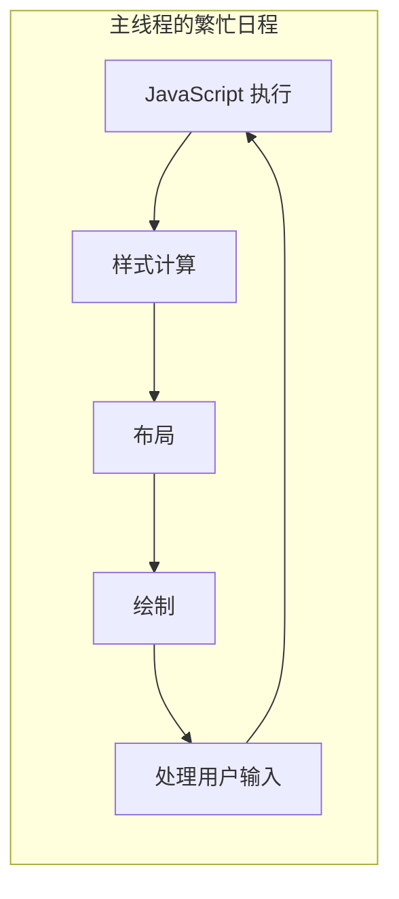
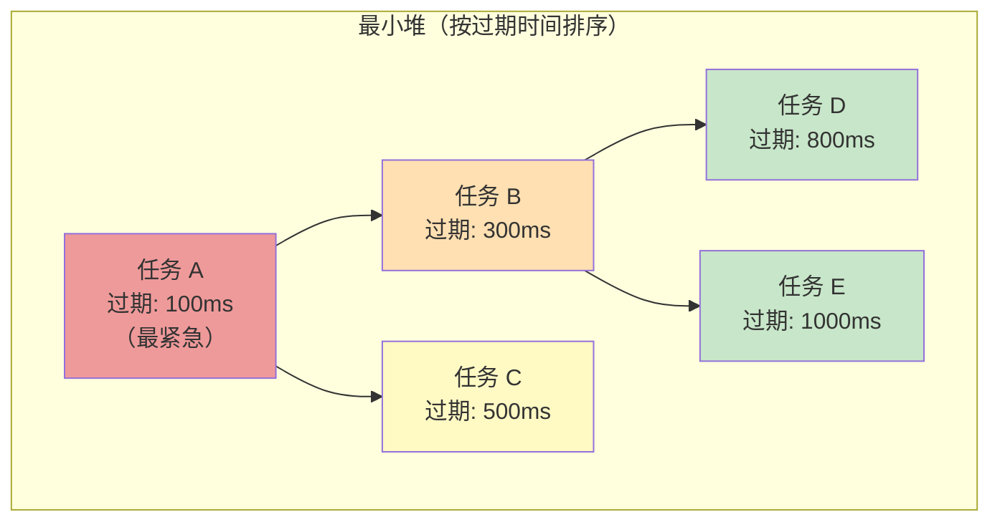
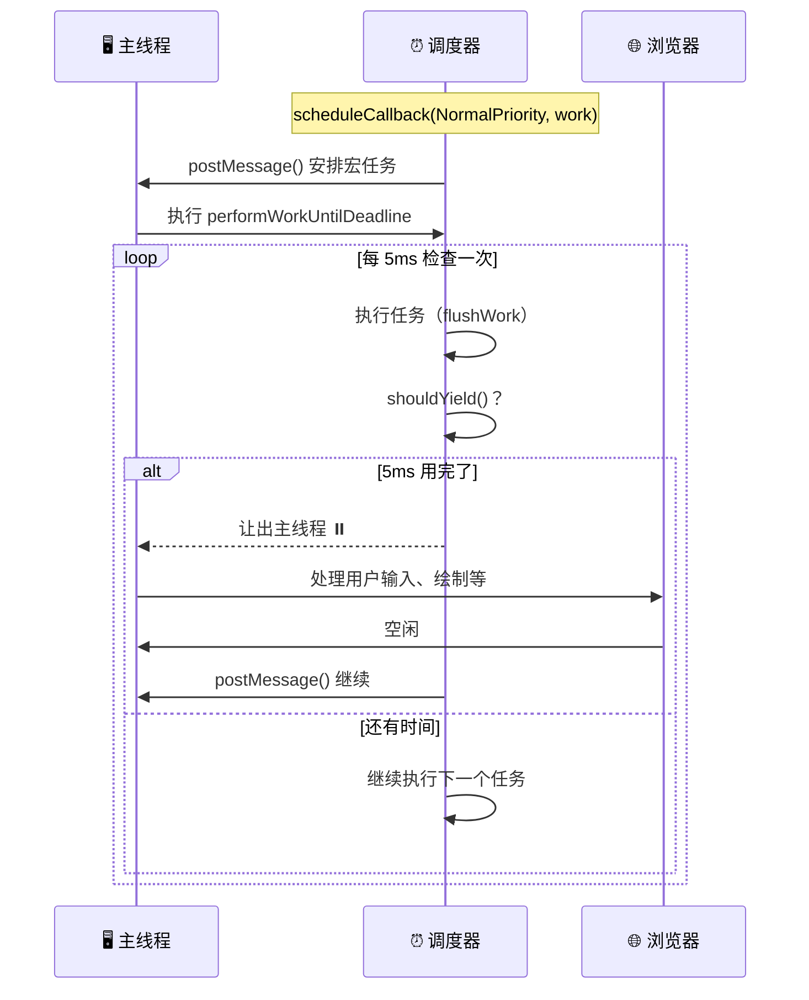
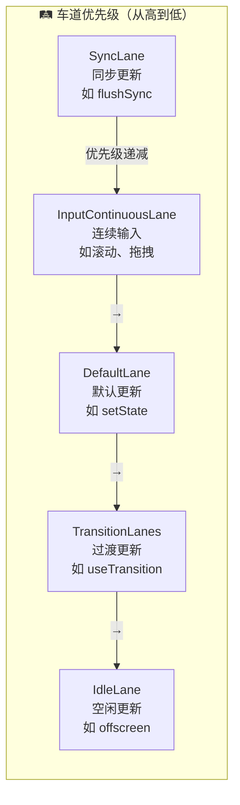
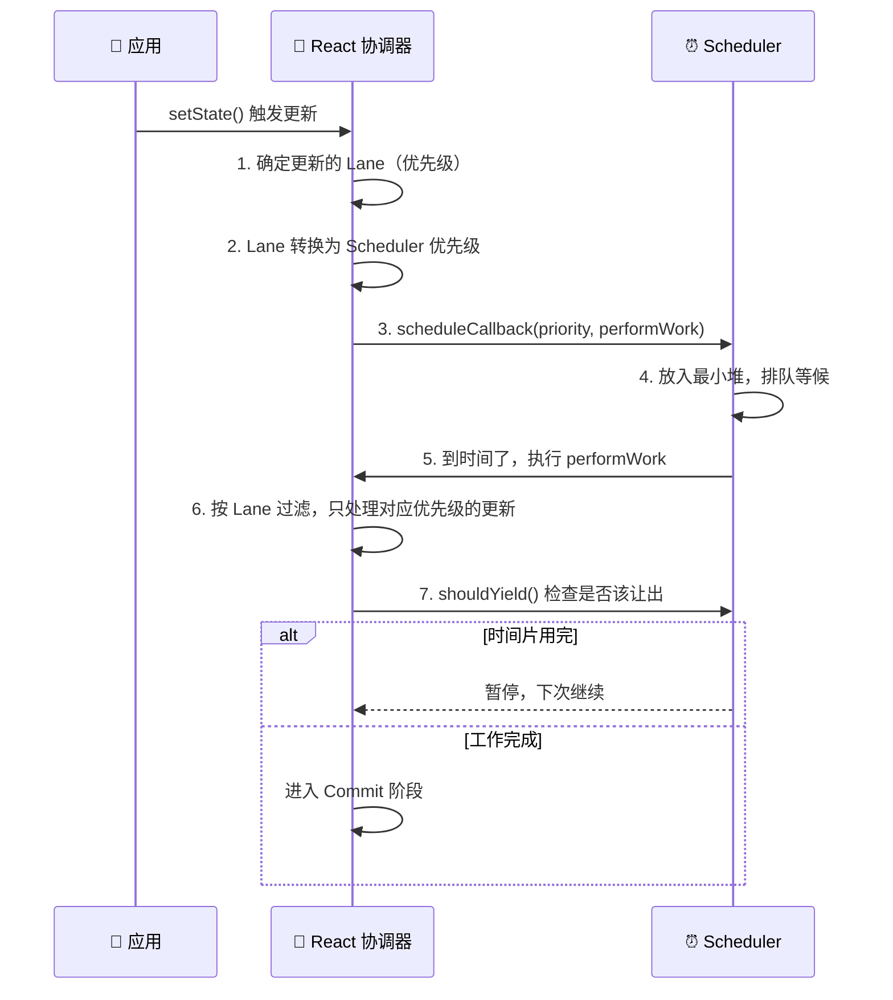
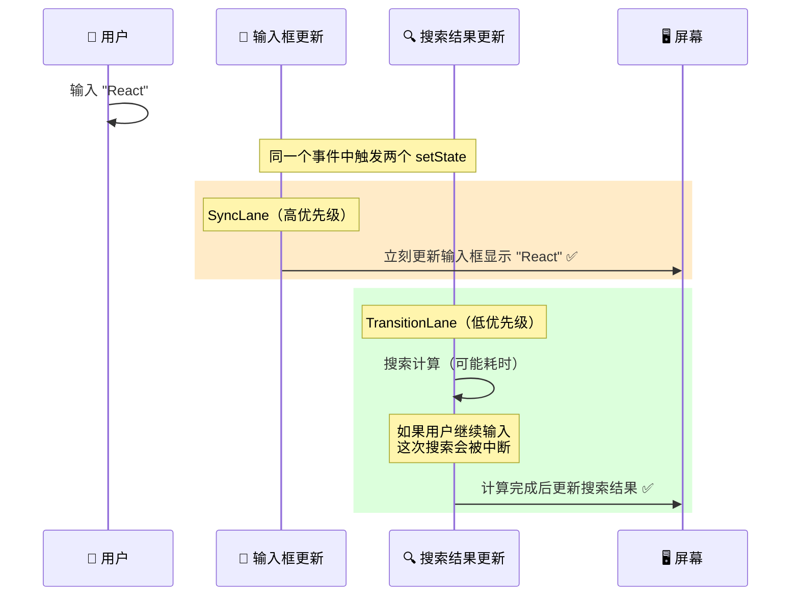
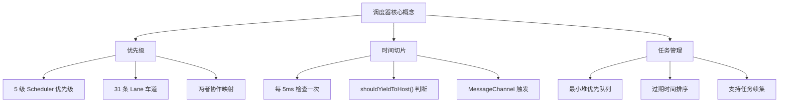

# ⏰ 第五章：调度器（Scheduler）原理

> 调度器是 React 并发模式的基石，它让 React 能够「聪明地」安排工作的优先级和执行时机。

## 🤔 为什么需要调度器？

浏览器的主线程是**单线程**的，需要处理很多任务：



如果 React 的渲染任务占用主线程太久，用户输入（如打字、点击）就会得不到响应，页面就会感觉「卡了」。

> 🌰 **通俗比喻 - 医院分诊**：
> 
> 想象一个急诊科只有一个医生（主线程）。如果来了一个需要做 2 小时手术的病人，其他所有病人都要等 2 小时。
> 
> 聪明的做法是：**分诊 + 优先级**。心脏病发作（用户输入）先看，普通感冒（低优先级渲染）排后面。而且大手术可以分步做——手术做一阵，出来看看有没有急诊，再回去继续做。
> 
> React 的调度器就是这个「分诊护士」。

## 📂 调度器的位置

```
packages/scheduler/src/
├── forks/
│   └── Scheduler.js          # ⏰ 调度器核心实现（约 600 行）
├── SchedulerMinHeap.js        # 📊 最小堆（优先队列）
└── SchedulerPriorities.js     # 🎯 优先级定义
```

## 🎯 优先级体系

### Scheduler 的 5 个优先级

```javascript
// packages/scheduler/src/SchedulerPriorities.js

const ImmediatePriority = 1;    // 🔴 立即执行（同步，如 flushSync）
const UserBlockingPriority = 2; // 🟠 用户交互（如点击、输入）
const NormalPriority = 3;       // 🟡 正常优先级（如普通 setState）
const LowPriority = 4;          // 🟢 低优先级（如不紧急的更新）
const IdlePriority = 5;         // 🔵 空闲优先级（浏览器空闲时才执行）
```

每个优先级对应一个**过期时间（Timeout）**，决定了任务最多可以等多久：

```javascript
// 不同优先级的超时时间
const IMMEDIATE_PRIORITY_TIMEOUT = -1;      // 立即过期
const USER_BLOCKING_PRIORITY_TIMEOUT = 250; // 250ms 后过期
const NORMAL_PRIORITY_TIMEOUT = 5000;       // 5 秒后过期
const LOW_PRIORITY_TIMEOUT = 10000;         // 10 秒后过期
const IDLE_PRIORITY_TIMEOUT = 1073741823;   // 永不过期（约 12 天）
```

> 🌰 **比喻**：就像外卖订单的配送优先级：
> - 🔴 **Immediate**（-1ms）= 到店自取，立刻就要
> - 🟠 **UserBlocking**（250ms）= 加急配送，15 分钟内必达
> - 🟡 **Normal**（5s）= 正常配送，1 小时内
> - 🟢 **Low**（10s）= 预约配送，今天到就行
> - 🔵 **Idle**（∞）= 有空再送

## 📊 最小堆（Min Heap）—— 高效的优先队列

调度器使用**最小堆**来管理任务队列，保证每次取出的都是优先级最高（过期时间最早）的任务。

> 📂 **源码位置**：`packages/scheduler/src/SchedulerMinHeap.js`

```javascript
// 最小堆的核心操作
export function push(heap, node) {
  const index = heap.length;
  heap.push(node);
  siftUp(heap, node, index);  // 上浮
}

export function peek(heap) {
  return heap.length === 0 ? null : heap[0];  // 查看堆顶（最高优先级）
}

export function pop(heap) {
  if (heap.length === 0) return null;
  const first = heap[0];
  const last = heap.pop();
  if (last !== first) {
    heap[0] = last;
    siftDown(heap, last, 0);  // 下沉
  }
  return first;
}
```



> 💡 **为什么用最小堆而不是排序数组？**
> - 插入任务：最小堆 O(log n) vs 排序数组 O(n)
> - 取最高优先级任务：都是 O(1)
> - 在任务频繁进出的场景，最小堆效率更高

## 🔄 核心调度流程

### scheduleCallback —— 注册任务

```javascript
// 简化自 packages/scheduler/src/forks/Scheduler.js

function scheduleCallback(priorityLevel, callback) {
  const currentTime = getCurrentTime();
  const startTime = currentTime;
  
  // 1️⃣ 根据优先级计算过期时间
  let timeout;
  switch (priorityLevel) {
    case ImmediatePriority: timeout = -1; break;
    case UserBlockingPriority: timeout = 250; break;
    case NormalPriority: timeout = 5000; break;
    case LowPriority: timeout = 10000; break;
    case IdlePriority: timeout = 1073741823; break;
  }
  const expirationTime = startTime + timeout;

  // 2️⃣ 创建任务对象
  const newTask = {
    id: taskIdCounter++,
    callback: callback,           // 要执行的工作函数
    priorityLevel: priorityLevel, // 优先级
    startTime: startTime,         // 开始时间
    expirationTime: expirationTime, // 过期时间
    sortIndex: expirationTime,    // 排序用（堆的比较键）
  };

  // 3️⃣ 放入任务队列（最小堆）
  push(taskQueue, newTask);

  // 4️⃣ 请求调度
  if (!isHostCallbackScheduled && !isPerformingWork) {
    isHostCallbackScheduled = true;
    requestHostCallback();  // 安排在下一帧执行
  }

  return newTask;
}
```

### requestHostCallback —— 请求执行时机

```javascript
// 使用 MessageChannel 在宏任务中执行（比 setTimeout 更快更精确）
const channel = new MessageChannel();
const port = channel.port2;

channel.port1.onmessage = performWorkUntilDeadline;

function requestHostCallback() {
  port.postMessage(null);  // 通过 MessageChannel 安排宏任务
}
```

> 💡 **为什么用 MessageChannel 而不是 setTimeout？**
> - `setTimeout(fn, 0)` 实际上有 4ms 的最小延迟（浏览器规范）
> - `MessageChannel` 的延迟更小，能更精确地利用每一帧的空闲时间
> - 这样 React 可以在每帧中做更多工作

### performWorkUntilDeadline —— 执行工作

```javascript
const frameYieldMs = 5;  // 每次工作 5ms 就让出主线程

function performWorkUntilDeadline() {
  const currentTime = getCurrentTime();
  
  // 计算截止时间：当前时间 + 5ms
  deadline = currentTime + frameYieldMs;
  
  const hasMoreWork = flushWork(currentTime);
  
  if (hasMoreWork) {
    // 还有工作，安排下一次执行
    port.postMessage(null);
  }
}
```



### flushWork —— 批量执行任务

```javascript
function flushWork(initialTime) {
  isPerformingWork = true;
  let currentPriorityLevel = NormalPriority;
  
  try {
    return workLoop(initialTime);
  } finally {
    currentTask = null;
    currentPriorityLevel = previousPriorityLevel;
    isPerformingWork = false;
  }
}

function workLoop(initialTime) {
  let currentTime = initialTime;
  
  // 取出优先级最高的任务
  currentTask = peek(taskQueue);
  
  while (currentTask !== null) {
    // ⏸️ 关键！如果任务没过期且时间片用完，暂停
    if (currentTask.expirationTime > currentTime && shouldYieldToHost()) {
      break;  // 让出主线程
    }
    
    const callback = currentTask.callback;
    if (typeof callback === 'function') {
      currentTask.callback = null;
      currentPriorityLevel = currentTask.priorityLevel;
      
      const didUserCallbackTimeout = currentTask.expirationTime <= currentTime;
      
      // 🔄 执行任务，可能返回「续集」
      const continuationCallback = callback(didUserCallbackTimeout);
      
      if (typeof continuationCallback === 'function') {
        // 任务没做完，保留续集
        currentTask.callback = continuationCallback;
        return true;  // 还有工作
      } else {
        // 任务做完了，移除
        if (currentTask === peek(taskQueue)) {
          pop(taskQueue);
        }
      }
    } else {
      pop(taskQueue);
    }
    
    currentTask = peek(taskQueue);
  }
  
  return currentTask !== null;  // 是否还有待处理的任务
}
```

### shouldYieldToHost —— 是否应该让出主线程

```javascript
function shouldYieldToHost() {
  const timeElapsed = getCurrentTime() - startTime;
  
  if (timeElapsed < frameYieldMs) {  // frameYieldMs = 5
    // 5ms 还没用完，继续工作
    return false;
  }
  
  // 5ms 用完了，该让出了
  return true;
}
```

> 🌰 **比喻**：你在图书馆用公共电脑（主线程）。规定每次只能用 5 分钟（5ms），然后要看看有没有人在排队（用户输入、浏览器绘制）。如果有人排队，让给他们用；如果没人，你可以继续用。

## ⏱️ 时间切片可视化

```mermaid
gantt
    title React 时间切片工作方式（16.6ms 一帧）
    dateFormat X
    axisFormat %L

    section 第 1 帧
    React 工作（5ms）     :active, 0, 5
    浏览器事件处理        :crit, 5, 8
    布局 & 绘制          :8, 12
    空闲                  :12, 16

    section 第 2 帧
    React 工作（5ms）     :active, 16, 21
    用户输入处理          :crit, 21, 23
    布局 & 绘制          :23, 27
    空闲                  :27, 32

    section 第 3 帧
    React 工作（5ms）     :active, 32, 37
    布局 & 绘制          :37, 41
    空闲                  :41, 48
```



## 🛤️ Lane 优先级模型

React 内部还有一套更精细的优先级系统 —— **Lanes（车道模型）**。它和 Scheduler 的优先级配合使用：

> 📂 **源码位置**：`packages/react-reconciler/src/ReactFiberLane.js`

```javascript
// Lane 使用 31 位的二进制数表示优先级
const NoLanes      = 0b0000000000000000000000000000000;
const NoLane       = 0b0000000000000000000000000000000;
const SyncLane     = 0b0000000000000000000000000000010;  // 同步
const InputContinuousLane = 0b0000000000000000000000000001000;  // 连续输入（滚动）
const DefaultLane  = 0b0000000000000000000000000100000;  // 默认
const TransitionLanes = 0b0000000001111111111111100000000;  // 过渡（多条车道）
const IdleLane     = 0b0010000000000000000000000000000;  // 空闲
```



> 🌰 **为什么叫「车道」？**
> 
> 想象一条高速公路有多条车道。**快车道**（SyncLane）用于紧急车辆，**慢车道**（IdleLane）用于大货车。每条车道有自己的通行规则，互不干扰。多条 TransitionLane 允许多个过渡任务并行处理。

### Lane 的位运算优势

```javascript
// 合并多个 Lane
const mergedLanes = SyncLane | DefaultLane;  // 两个更新同时存在

// 检查是否包含某个 Lane
const includesSync = (lanes & SyncLane) !== NoLanes;

// 取出最高优先级的 Lane
function getHighestPriorityLane(lanes) {
  return lanes & -lanes;  // 取最低位的 1（最高优先级）
}
```

## 🔗 Scheduler 与 Lanes 的协作



```javascript
// Lane → Scheduler 优先级 的映射
function lanesToSchedulerPriority(lanes) {
  const lane = getHighestPriorityLane(lanes);
  
  if (lane === SyncLane) {
    return ImmediatePriority;
  }
  if (lane === InputContinuousLane) {
    return UserBlockingPriority;
  }
  if (lane === DefaultLane) {
    return NormalPriority;
  }
  if (lane === IdleLane) {
    return IdlePriority;
  }
  return NormalPriority;
}
```

## 🧪 实际例子：输入框 + 搜索

```jsx
function SearchApp() {
  const [input, setInput] = useState('');
  const [results, setResults] = useState([]);

  function handleChange(e) {
    // 🟠 高优先级：立即更新输入框（用户体验）
    setInput(e.target.value);
    
    // 🟡 低优先级：可以稍后更新搜索结果（startTransition）
    startTransition(() => {
      setResults(search(e.target.value));
    });
  }

  return (
    <div>
      <input value={input} onChange={handleChange} />
      <SearchResults results={results} />
    </div>
  );
}
```

调度过程：



## 📝 本章小结



**核心要点**：
1. ⏰ 调度器让 React 能够**按优先级执行任务**，高优先级中断低优先级
2. ⏱️ 时间切片每 5ms 让出主线程，保证页面不卡顿
3. 📊 最小堆高效管理任务队列
4. 🛤️ Lane 模型提供更精细的优先级控制
5. 🤝 Scheduler 和 Lanes 协作，实现 React 的并发渲染能力

---

📖 **下一章**：[Hooks 实现原理 →](./06-hooks.md)

> 在下一章，我们将深入 Hooks 的底层实现，看看 useState 和 useEffect 在 Fiber 中是如何运作的。
