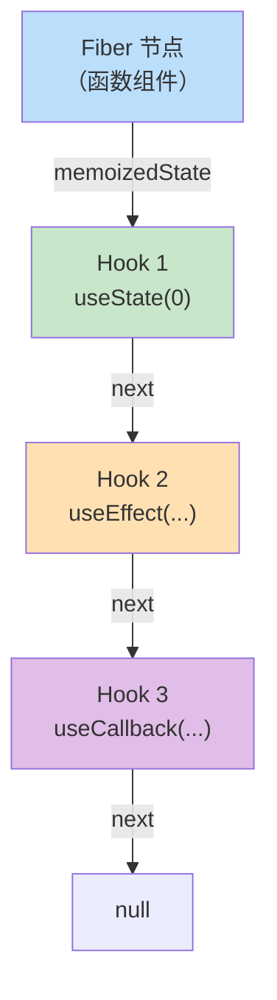
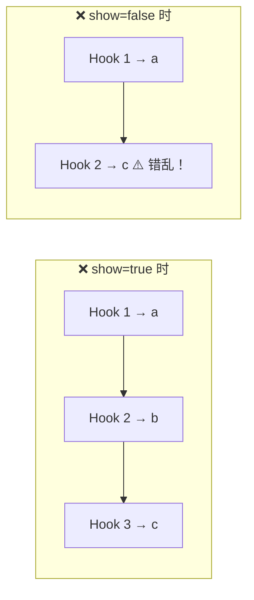
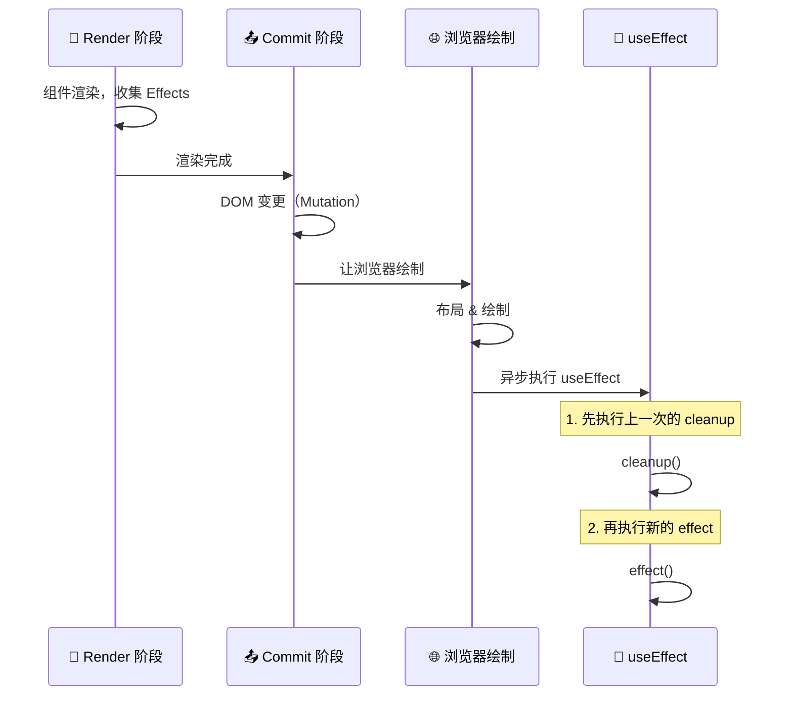
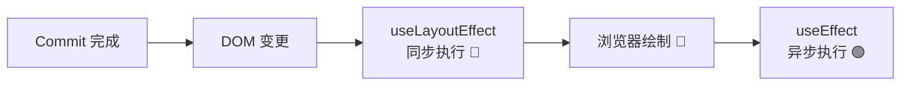
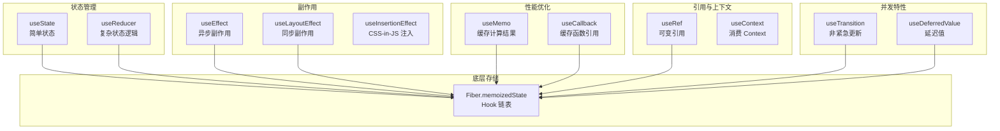

# 🪝 第六章：Hooks 实现原理

> Hooks 是 React 最重要的特性之一。本章带你揭开 useState、useEffect 等 Hooks 的底层面纱。

## 🤔 Hooks 解决了什么问题？

在 Hooks 出现之前，只有 Class 组件能使用状态和生命周期：

```jsx
// ❌ 旧方式：Class 组件（冗长、this 指向混乱）
class Counter extends React.Component {
  constructor(props) {
    super(props);
    this.state = { count: 0 };
    this.handleClick = this.handleClick.bind(this);  // 烦人的 bind
  }
  
  componentDidMount() { document.title = `Count: ${this.state.count}`; }
  componentDidUpdate() { document.title = `Count: ${this.state.count}`; }
  
  handleClick() { this.setState({ count: this.state.count + 1 }); }
  
  render() {
    return <button onClick={this.handleClick}>{this.state.count}</button>;
  }
}

// ✅ 新方式：函数组件 + Hooks（简洁、直观）
function Counter() {
  const [count, setCount] = useState(0);
  useEffect(() => { document.title = `Count: ${count}`; });
  return <button onClick={() => setCount(count + 1)}>{count}</button>;
}
```

> 🌰 **比喻**：Class 组件就像填一份复杂的政府表格，有很多必填项（constructor、this、bind），还得分散在不同区域填写。Hooks 就像用手机 App 办事，简洁直观，一步到位。

## 🏗️ Hooks 的存储结构

Hooks 的状态存储在对应的 **Fiber 节点**上，以**链表**形式组织：

> 📂 **源码位置**：`packages/react-reconciler/src/ReactFiberHooks.js`



每个 Hook 节点的结构：

```javascript
// Hook 对象
const hook = {
  memoizedState: null,  // 📦 当前状态值
  baseState: null,      // 📋 基础状态（用于更新计算）
  baseQueue: null,      // 📝 上次未处理完的更新队列
  queue: null,          // 📨 更新队列（待处理的 setState）
  next: null,           // ➡️ 指向下一个 Hook
};
```

> 💡 **这就是为什么 Hooks 不能在条件语句中使用！** 因为 React 靠**调用顺序**来匹配 Hook 和它的状态。如果顺序变了，状态就对不上了。

```jsx
// ❌ 绝对不能这样做！
function Bad({ show }) {
  const [a, setA] = useState(0);  // Hook 1
  if (show) {
    const [b, setB] = useState(0);  // 有时是 Hook 2，有时不存在！
  }
  const [c, setC] = useState(0);  // 有时是 Hook 2，有时是 Hook 3！
}
```



## 🔄 renderWithHooks —— Hook 执行的入口

每次函数组件渲染时，React 都会调用 `renderWithHooks`：

```javascript
// 简化自 packages/react-reconciler/src/ReactFiberHooks.js

function renderWithHooks(current, workInProgress, Component, props, secondArg, nextRenderLanes) {
  // 1️⃣ 设置当前正在工作的 Fiber
  currentlyRenderingFiber = workInProgress;
  
  // 2️⃣ 重置 Hooks 链表（准备重新构建）
  workInProgress.memoizedState = null;
  workInProgress.updateQueue = null;
  
  // 3️⃣ 选择正确的 Hooks 分发器
  if (current !== null && current.memoizedState !== null) {
    // 更新阶段 → 使用更新版本的 Hooks
    ReactSharedInternals.H = HooksDispatcherOnUpdate;
  } else {
    // 首次渲染 → 使用挂载版本的 Hooks
    ReactSharedInternals.H = HooksDispatcherOnMount;
  }
  
  // 4️⃣ 调用组件函数！（这时候你的 Hooks 会依次执行）
  let children = Component(props, secondArg);
  
  // 5️⃣ 清理
  currentlyRenderingFiber = null;
  
  return children;
}
```

### 两套 Dispatcher

React 为**首次渲染（Mount）** 和**更新（Update）** 准备了两套不同的 Hook 实现：

```javascript
const HooksDispatcherOnMount = {
  useState: mountState,
  useEffect: mountEffect,
  useCallback: mountCallback,
  useMemo: mountMemo,
  useRef: mountRef,
  useContext: readContext,
  // ...
};

const HooksDispatcherOnUpdate = {
  useState: updateState,
  useEffect: updateEffect,
  useCallback: updateCallback,
  useMemo: updateMemo,
  useRef: updateRef,
  useContext: readContext,
  // ...
};
```

> 🌰 **比喻**：就像搬新家和住老房。搬新家（Mount）时要买新家具、接水电。住老房（Update）时只需要换换摆设。虽然住户（你的代码）的操作看起来一样（调 useState），但背后的实现完全不同。

## 📦 useState 的实现

### Mount 阶段（首次渲染）

```javascript
function mountState(initialState) {
  // 1️⃣ 创建新的 Hook 节点，挂到链表上
  const hook = mountWorkInProgressHook();
  
  // 2️⃣ 计算初始状态
  if (typeof initialState === 'function') {
    initialState = initialState();  // 支持 useState(() => expensiveComputation())
  }
  hook.memoizedState = initialState;
  hook.baseState = initialState;
  
  // 3️⃣ 创建更新队列
  const queue = {
    pending: null,        // 等待处理的更新（环形链表）
    lanes: NoLanes,
    dispatch: null,       // setState 函数
    lastRenderedReducer: basicStateReducer,
    lastRenderedState: initialState,
  };
  hook.queue = queue;
  
  // 4️⃣ 创建 setState 函数（绑定了 Fiber 和 queue）
  const dispatch = (queue.dispatch = dispatchSetState.bind(
    null,
    currentlyRenderingFiber,
    queue
  ));
  
  // 5️⃣ 返回 [state, setState]
  return [hook.memoizedState, dispatch];
}
```

### Update 阶段（后续渲染）

```javascript
function updateState(initialState) {
  return updateReducer(basicStateReducer, initialState);
}

function updateReducer(reducer, initialArg) {
  // 1️⃣ 找到对应的 Hook（从链表中取下一个）
  const hook = updateWorkInProgressHook();
  const queue = hook.queue;
  
  // 2️⃣ 处理所有排队中的更新
  const pending = queue.pending;
  if (pending !== null) {
    let newState = hook.baseState;
    let update = pending.next;  // 环形链表的第一个
    
    do {
      // 逐个应用更新
      const action = update.action;
      newState = reducer(newState, action);
      update = update.next;
    } while (update !== pending.next);
    
    hook.memoizedState = newState;
    hook.baseState = newState;
    queue.lastRenderedState = newState;
  }
  
  // 3️⃣ 返回新状态和 dispatch
  return [hook.memoizedState, queue.dispatch];
}
```

### dispatchSetState —— setState 的真面目

```javascript
function dispatchSetState(fiber, queue, action) {
  // 1️⃣ 确定更新优先级
  const lane = requestUpdateLane(fiber);
  
  // 2️⃣ 创建更新对象
  const update = {
    lane: lane,
    action: action,       // 你传给 setState 的值或函数
    hasEagerState: false,
    eagerState: null,
    next: null,
  };
  
  // 3️⃣ 快速路径：如果在非渲染时触发，可以提前计算新状态
  if (fiber.lanes === NoLanes) {
    const currentState = queue.lastRenderedState;
    const eagerState = typeof action === 'function' 
      ? action(currentState) 
      : action;
    
    update.hasEagerState = true;
    update.eagerState = eagerState;
    
    // 如果新状态和旧状态相同，可以跳过渲染！
    if (Object.is(eagerState, currentState)) {
      return;  // 🚀 Bailout！不触发重渲染
    }
  }
  
  // 4️⃣ 将更新加入队列
  enqueueUpdate(fiber, queue, update, lane);
  
  // 5️⃣ 调度更新
  scheduleUpdateOnFiber(fiber, lane);
}
```

> 🌰 **useState 完整流程比喻**：
> 1. **mountState**（开户）= 去银行开户，设置初始余额，拿到存折（state）和取款卡（setState）
> 2. **dispatchSetState**（转账）= 用取款卡发起转账请求（创建 update），银行排队处理（queue）
> 3. **updateReducer**（结算）= 银行处理所有排队的转账，计算最终余额

## 🌊 useEffect 的实现

### Mount 阶段

```javascript
function mountEffect(create, deps) {
  return mountEffectImpl(
    PassiveEffect | PassiveStaticEffect,  // 副作用标记
    HookPassive,                           // Hook 标记
    create,                                // effect 函数
    deps                                   // 依赖数组
  );
}

function mountEffectImpl(fiberFlags, hookFlags, create, deps) {
  // 1️⃣ 创建 Hook 节点
  const hook = mountWorkInProgressHook();
  
  const nextDeps = deps === undefined ? null : deps;
  
  // 2️⃣ 给 Fiber 标记「有 Passive Effect」
  currentlyRenderingFiber.flags |= fiberFlags;
  
  // 3️⃣ 创建 Effect 对象，存储在 Hook 上
  hook.memoizedState = pushEffect(
    HookHasEffect | hookFlags,  // 标记需要执行
    create,                      // effect 创建函数
    createEffectInstance(),       // 用于存储 cleanup 函数
    nextDeps                     // 依赖数组
  );
}
```

### Update 阶段

```javascript
function updateEffect(create, deps) {
  return updateEffectImpl(PassiveEffect, HookPassive, create, deps);
}

function updateEffectImpl(fiberFlags, hookFlags, create, deps) {
  const hook = updateWorkInProgressHook();
  const nextDeps = deps === undefined ? null : deps;
  const prevEffect = hook.memoizedState;  // 上一次的 Effect
  
  if (nextDeps !== null) {
    const prevDeps = prevEffect.deps;
    
    // 🔍 对比依赖是否变化
    if (areHookInputsEqual(nextDeps, prevDeps)) {
      // 依赖没变 → 不需要重新执行 Effect
      hook.memoizedState = pushEffect(hookFlags, create, prevEffect.inst, nextDeps);
      return;
    }
  }
  
  // 依赖变了 → 标记需要执行
  currentlyRenderingFiber.flags |= fiberFlags;
  hook.memoizedState = pushEffect(
    HookHasEffect | hookFlags,
    create,
    prevEffect.inst,
    nextDeps
  );
}
```

### Effect 的执行时机



> 💡 **useEffect vs useLayoutEffect**：
> - `useEffect`：在浏览器绘制**之后**异步执行（不阻塞绘制）
> - `useLayoutEffect`：在浏览器绘制**之前**同步执行（会阻塞绘制）



### 依赖对比逻辑

```javascript
function areHookInputsEqual(nextDeps, prevDeps) {
  if (prevDeps === null) return false;
  
  for (let i = 0; i < prevDeps.length && i < nextDeps.length; i++) {
    // 使用 Object.is 进行浅比较
    if (Object.is(nextDeps[i], prevDeps[i])) {
      continue;
    }
    return false;  // 有一个依赖变了，就认为需要重新执行
  }
  return true;
}
```

> ⚠️ **注意**：依赖对比是**浅比较**（Object.is），所以对象和数组每次都是新引用：
> ```jsx
> // ❌ 每次渲染 obj 都是新引用，effect 每次都会执行
> useEffect(() => { ... }, [{ name: 'React' }]);
> 
> // ✅ 使用具体的值作为依赖
> useEffect(() => { ... }, [name]);
> ```

## 📌 useRef 的实现

useRef 是最简单的 Hook：

```javascript
// Mount
function mountRef(initialValue) {
  const hook = mountWorkInProgressHook();
  const ref = { current: initialValue };
  hook.memoizedState = ref;
  return ref;
}

// Update
function updateRef(initialValue) {
  const hook = updateWorkInProgressHook();
  return hook.memoizedState;  // 直接返回同一个对象引用
}
```

> 💡 **为什么 useRef 不会触发重渲染？** 因为它就是返回一个普通对象 `{ current: value }`，修改 `ref.current` 不会调用任何更新调度逻辑。

## 🧠 useMemo 和 useCallback

```javascript
// useMemo：缓存计算结果
function mountMemo(nextCreate, deps) {
  const hook = mountWorkInProgressHook();
  const nextDeps = deps === undefined ? null : deps;
  const nextValue = nextCreate();  // 执行计算函数
  hook.memoizedState = [nextValue, nextDeps];
  return nextValue;
}

function updateMemo(nextCreate, deps) {
  const hook = updateWorkInProgressHook();
  const nextDeps = deps === undefined ? null : deps;
  const prevState = hook.memoizedState;
  
  if (prevState !== null && nextDeps !== null) {
    const prevDeps = prevState[1];
    if (areHookInputsEqual(nextDeps, prevDeps)) {
      return prevState[0];  // 依赖没变，返回缓存值
    }
  }
  
  const nextValue = nextCreate();
  hook.memoizedState = [nextValue, nextDeps];
  return nextValue;
}

// useCallback：缓存函数引用（本质是 useMemo 的特化版）
function mountCallback(callback, deps) {
  const hook = mountWorkInProgressHook();
  hook.memoizedState = [callback, deps];  // 直接存函数，不执行
  return callback;
}

function updateCallback(callback, deps) {
  const hook = updateWorkInProgressHook();
  const prevState = hook.memoizedState;
  
  if (prevState !== null && deps !== null) {
    if (areHookInputsEqual(deps, prevState[1])) {
      return prevState[0];  // 依赖没变，返回旧函数
    }
  }
  
  hook.memoizedState = [callback, deps];
  return callback;
}
```

> 🌰 **useMemo vs useCallback 的区别**：
> - `useMemo(() => compute(a, b), [a, b])` → 缓存**计算结果**（执行函数，存返回值）
> - `useCallback((x) => x + a, [a])` → 缓存**函数本身**（不执行，存函数引用）

## 🔗 useContext 的实现

```javascript
function readContext(context) {
  // 直接从 Context 对象上读取当前值
  const value = context._currentValue;
  
  // 记录依赖关系（当 Provider value 变化时，订阅更新）
  const contextItem = {
    context: context,
    memoizedValue: value,
    next: null,
  };
  
  // 添加到当前 Fiber 的依赖列表
  if (lastContextDependency === null) {
    currentlyRenderingFiber.dependencies = { lanes: NoLanes, firstContext: contextItem };
  } else {
    lastContextDependency.next = contextItem;
  }
  
  return value;
}
```

## 🗺️ Hooks 全景图



## 📝 本章小结

**核心要点**：
1. 🔗 Hooks 以**链表**形式存储在 Fiber 节点的 `memoizedState` 上
2. 📏 Hooks 依赖**调用顺序**匹配状态，所以不能在条件语句中使用
3. 🔄 Mount 和 Update 使用**两套不同的实现**（Dispatcher）
4. 📦 `useState` 的 `setState` 会创建 update 对象加入队列，然后调度渲染
5. 🌊 `useEffect` 在浏览器绘制**之后**异步执行，`useLayoutEffect` 在绘制**之前**同步执行
6. ⚡ `Object.is` 浅比较决定是否需要重新执行 Effect 或重新计算 Memo

---

📖 **下一章**：[事件系统 →](./07-event-system.md)

> 在下一章，我们将深入 React 的事件系统，理解合成事件和事件委托的实现。
