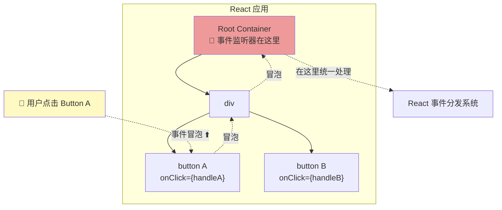
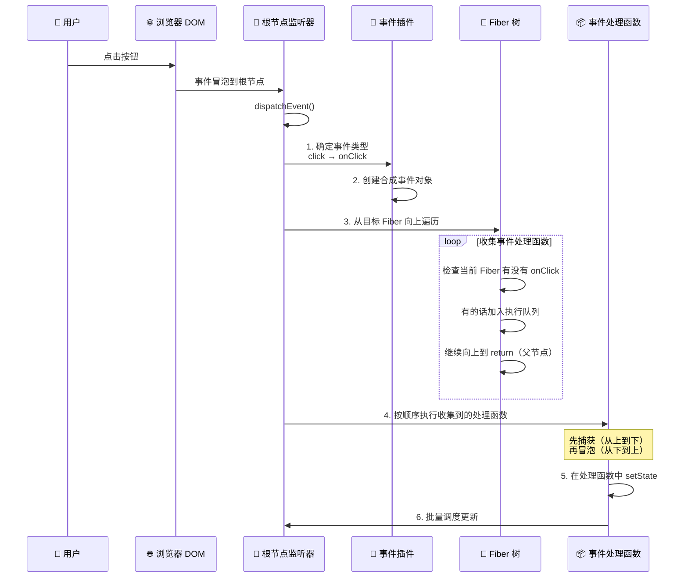
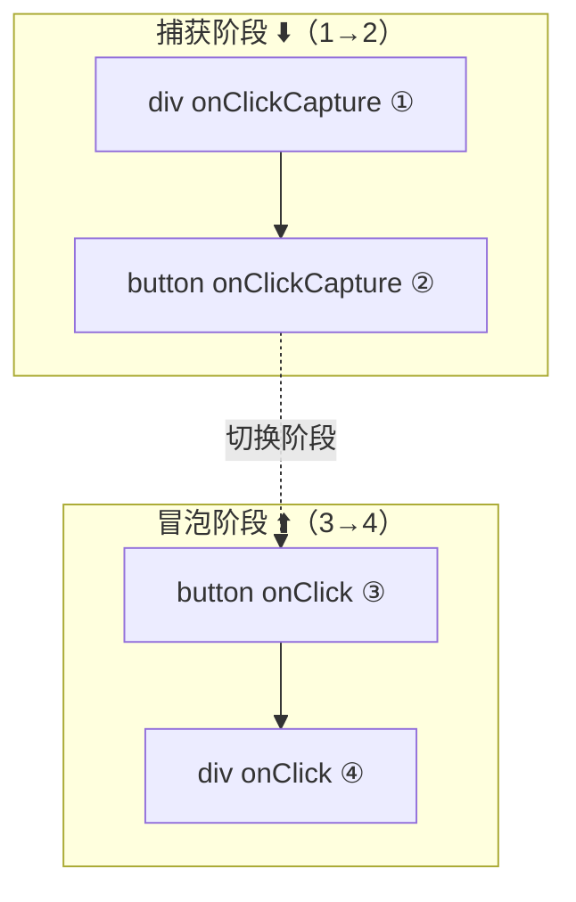
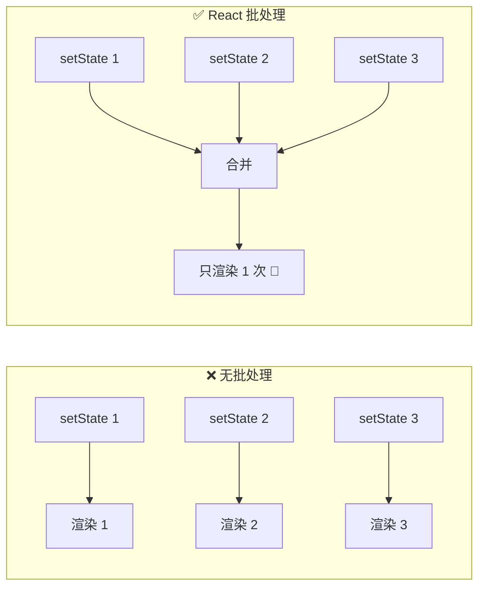
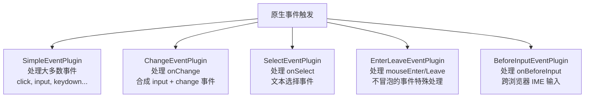
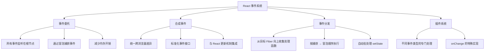

# 🎯 第七章：事件系统

> React 有自己的一套事件系统，它不是直接绑定在 DOM 上，而是采用了「事件委托」+ 「合成事件」的设计。

## 🤔 为什么 React 要自己实现事件系统？

浏览器原生事件系统有几个问题：

1. **跨浏览器不一致**：不同浏览器的事件对象属性和行为有差异
2. **内存开销**：给每个元素都绑定事件监听器，元素多了会消耗大量内存
3. **无法和 React 更新机制集成**：原生事件触发后，React 无法控制更新的时机和批处理

> 🌰 **比喻**：想象一栋大楼的收发室。与其每个办公室自己派人去门口收快递（原生事件），不如在一楼设一个统一的收发室（事件委托），所有快递都送到收发室，由收发室分发到各办公室 —— 更高效、更统一。

## 📂 事件系统的源码结构

```
packages/react-dom-bindings/src/events/
├── DOMPluginEventSystem.js      # 🎯 事件委托和分发的核心
├── ReactDOMEventListener.js     # 👂 事件监听器（根节点上）
├── DOMEventNames.js             # 📛 事件名映射（onClick → click）
├── DOMEventProperties.js        # 📋 事件属性标准化
├── EventRegistry.js             # 📝 事件注册表
├── SyntheticEvent.js            # 🔄 合成事件
├── ReactDOMEventReplaying.js    # 🔁 事件重放（配合 Suspense）
└── plugins/
    ├── SimpleEventPlugin.js     # 简单事件（click, input 等）
    ├── ChangeEventPlugin.js     # onChange 事件
    ├── SelectEventPlugin.js     # onSelect 事件
    ├── BeforeInputEventPlugin.js# onBeforeInput 事件
    └── EnterLeaveEventPlugin.js # onMouseEnter/Leave 事件
```

## 🏗️ 事件委托（Event Delegation）

React 不会在每个 DOM 元素上绑定事件处理函数。相反，它在**根节点**上绑定一个监听器，通过事件冒泡来捕获所有事件。



### 事件监听器的注册

```javascript
// 简化自 packages/react-dom-bindings/src/events/DOMPluginEventSystem.js

function listenToAllSupportedEvents(rootContainerElement) {
  allNativeEvents.forEach(domEventName => {
    // 同时监听捕获和冒泡阶段
    listenToNativeEvent(domEventName, false, rootContainerElement);  // 冒泡
    listenToNativeEvent(domEventName, true, rootContainerElement);   // 捕获
  });
}

function listenToNativeEvent(domEventName, isCapturePhaseListener, target) {
  let listener = isCapturePhaseListener
    ? dispatchEvent.bind(null, domEventName, EventSystemFlags, target)  // 捕获
    : dispatchEvent.bind(null, domEventName, EventSystemFlags, target); // 冒泡
    
  if (isCapturePhaseListener) {
    target.addEventListener(domEventName, listener, true);   // capture: true
  } else {
    target.addEventListener(domEventName, listener, false);  // capture: false
  }
}
```

> 💡 **为什么在根节点注册？**
> - **一个监听器处理所有**：不管有多少个 `<button onClick={...}>`，根节点上只有一个 `click` 监听器
> - **动态添加的元素自动工作**：新渲染的按钮不需要额外绑定事件
> - **内存效率高**：100 个按钮只需要 1 个监听器，而不是 100 个

## 🔄 合成事件（SyntheticEvent）

React 不会直接把浏览器原生事件传给你的处理函数，而是包装成**合成事件**：

```mermaid
graph LR
    NATIVE["浏览器原生事件<br/>MouseEvent / KeyboardEvent"]
    -->|"包装"| 
    SYNTHETIC["React 合成事件<br/>SyntheticEvent"]
    -->|"传给"| 
    HANDLER["你的处理函数<br/>onClick={(e) => ...}"]
```

> 📂 **源码位置**：`packages/react-dom-bindings/src/events/SyntheticEvent.js`

```javascript
// 简化的合成事件创建
function createSyntheticEvent(Interface) {
  function SyntheticBaseEvent(reactName, reactEventType, targetInst, nativeEvent, nativeEventTarget) {
    this._reactName = reactName;          // 如 'onClick'
    this.type = reactEventType;            // 如 'click'
    this.nativeEvent = nativeEvent;        // 原生事件对象
    this.target = nativeEventTarget;       // 事件目标
    this.currentTarget = null;             // 当前处理的元素

    // 从 Interface 复制标准化的属性
    for (const propName in Interface) {
      this[propName] = nativeEvent[propName];
    }

    // 标准化方法
    this.preventDefault = function() {
      const event = nativeEvent;
      if (event.preventDefault) {
        event.preventDefault();
      } else {
        event.returnValue = false;
      }
      this.isDefaultPrevented = true;
    };

    this.stopPropagation = function() {
      const event = nativeEvent;
      if (event.stopPropagation) {
        event.stopPropagation();
      } else {
        event.cancelBubble = true;
      }
      this.isPropagationStopped = true;
    };

    return this;
  }
  
  return SyntheticBaseEvent;
}
```

### 不同类型的合成事件

```javascript
// 鼠标事件接口
const MouseEventInterface = {
  screenX: 0,
  screenY: 0,
  clientX: 0,
  clientY: 0,
  pageX: 0,
  pageY: 0,
  button: 0,
  buttons: 0,
  // ...
};

// 键盘事件接口
const KeyboardEventInterface = {
  key: 0,
  code: 0,
  charCode: 0,
  keyCode: 0,
  which: 0,
  altKey: 0,
  ctrlKey: 0,
  metaKey: 0,
  shiftKey: 0,
  // ...
};
```

> 🌰 **比喻**：合成事件就像一个**翻译官**。不同国家（浏览器）说不同方言（事件 API），翻译官把它们都翻译成标准普通话（统一的合成事件接口），让你不用关心底层差异。

## 🚀 事件分发流程

当一个事件发生时，完整的处理流程如下：



### 核心代码：事件分发

```javascript
// 简化的事件分发逻辑

function dispatchEvent(domEventName, eventSystemFlags, targetContainer, nativeEvent) {
  // 1️⃣ 找到事件目标对应的 Fiber
  const nativeEventTarget = nativeEvent.target;
  const targetInst = getClosestInstanceFromNode(nativeEventTarget);
  
  // 2️⃣ 分发到对应的事件插件处理
  dispatchEventForPluginEventSystem(
    domEventName,
    eventSystemFlags,
    nativeEvent,
    targetInst,
    targetContainer
  );
}

function dispatchEventForPluginEventSystem(domEventName, eventSystemFlags, nativeEvent, targetInst, targetContainer) {
  // 3️⃣ 收集事件路径上的所有处理函数
  const listeners = [];
  
  // 从目标 Fiber 向上遍历到根
  let instance = targetInst;
  while (instance !== null) {
    const { stateNode, tag } = instance;
    if (tag === HostComponent && stateNode !== null) {
      // 检查这个 DOM 组件上有没有对应的事件处理函数
      const listener = getListener(instance, reactEventName);
      if (listener != null) {
        listeners.push({
          instance,
          listener,
          currentTarget: stateNode,
        });
      }
    }
    instance = instance.return;
  }
  
  // 4️⃣ 创建合成事件并执行处理函数
  const syntheticEvent = new SyntheticEvent(reactName, domEventName, targetInst, nativeEvent);
  
  for (const { listener, currentTarget } of listeners) {
    syntheticEvent.currentTarget = currentTarget;
    listener(syntheticEvent);
    
    if (syntheticEvent.isPropagationStopped) {
      break;  // stopPropagation 会阻止后续处理函数的执行
    }
  }
}
```

## 🔀 捕获与冒泡

React 支持两种事件阶段：

```jsx
<div 
  onClick={() => console.log('div 冒泡')}         // 冒泡阶段
  onClickCapture={() => console.log('div 捕获')}   // 捕获阶段
>
  <button 
    onClick={() => console.log('button 冒泡')}
    onClickCapture={() => console.log('button 捕获')}
  >
    点击我
  </button>
</div>

// 点击按钮后的输出顺序：
// 1. "div 捕获"       ← 从上到下（捕获）
// 2. "button 捕获"    ← 
// 3. "button 冒泡"    ← 从下到上（冒泡）
// 4. "div 冒泡"       ← 
```



## 🔄 事件批处理

React 会自动批处理事件处理函数中的多个 `setState`：

```jsx
function handleClick() {
  setCount(c => c + 1);    // 不会立即渲染
  setName('React');         // 不会立即渲染
  setFlag(true);            // 不会立即渲染
  // → 三个更新合并为一次渲染 ✅
}
```



> 💡 **React 18 的改进**：在 React 18 之前，只有在 React 事件处理函数中才会自动批处理。异步操作（setTimeout、Promise）中不会。React 18+ 通过 `createRoot` 实现了**自动批处理（Automatic Batching）**，所有场景下都会批处理。

## 🔌 事件插件系统

React 使用**插件**来处理不同类型的事件，每个插件负责一类事件的标准化和特殊处理：



### onChange 的特殊处理

你可能不知道，React 的 `onChange` 跟原生的 `change` 事件**完全不同**：

```jsx
// 原生 change 事件：input 失去焦点时才触发
// React onChange：每次输入都触发（实际上监听的是 input 事件）

<input onChange={(e) => setValue(e.target.value)} />
```

```javascript
// ChangeEventPlugin 的简化逻辑
// 实际上 React 监听了多个原生事件来实现 onChange：
// - input 事件（最主要）
// - change 事件
// - blur 事件
// - focus 事件

function extractEvents(domEventName, targetInst, nativeEvent) {
  if (domEventName === 'input' || domEventName === 'change') {
    const value = getValueFromNode(nativeEvent.target);
    if (value !== lastValue) {
      lastValue = value;
      // 触发 React 的 onChange
      return createSyntheticEvent('onChange', ...);
    }
  }
}
```

> 🌰 **比喻**：React 的 onChange 就像一个勤快的秘书。原生 change 事件只在你写完整封信（离开输入框）时才通知老板。React 的 onChange 每写一个字（每次输入）就通知老板 —— 对于实时表单验证等场景非常有用。

## 📝 本章小结



**核心要点**：
1. 🎯 事件委托在根节点上注册，一个监听器处理所有同类事件
2. 🔄 合成事件包装原生事件，统一跨浏览器差异
3. 🌲 事件分发时沿 Fiber 树向上收集处理函数
4. ⚡ React 18+ 在所有场景下自动批处理
5. 🔌 插件系统处理不同类型事件的特殊逻辑

---

📖 **下一章**：[渲染与提交流程 →](./08-render-and-commit.md)

> 在下一章，我们将完整串联 React 从触发更新到 DOM 变更的整个流程。
