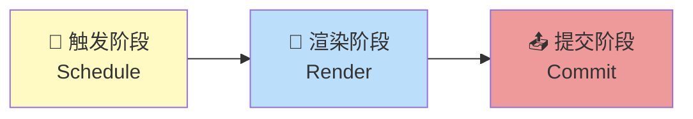
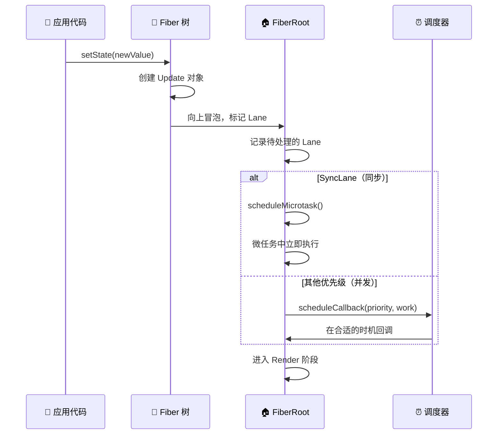
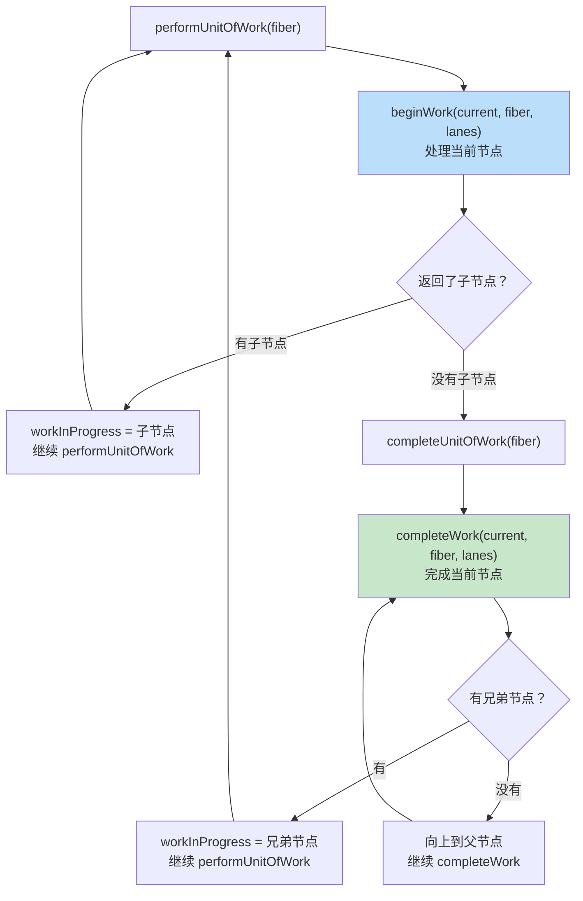
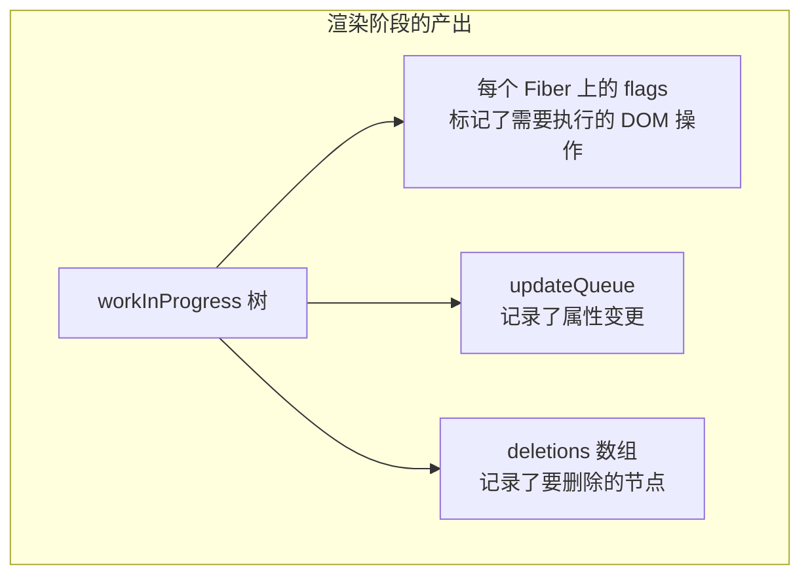
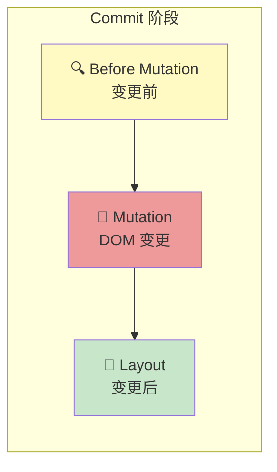
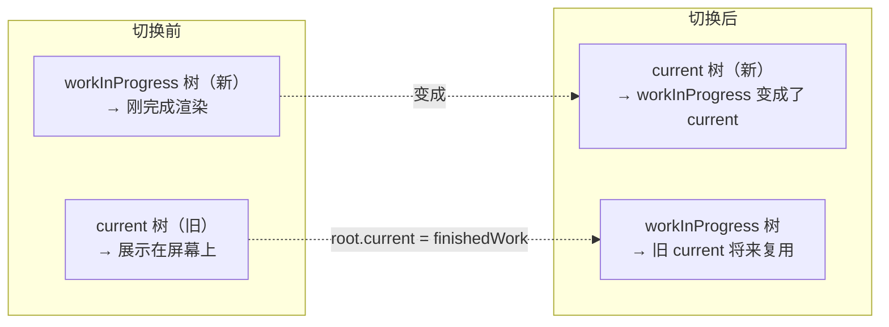
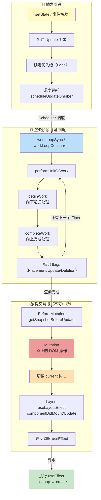
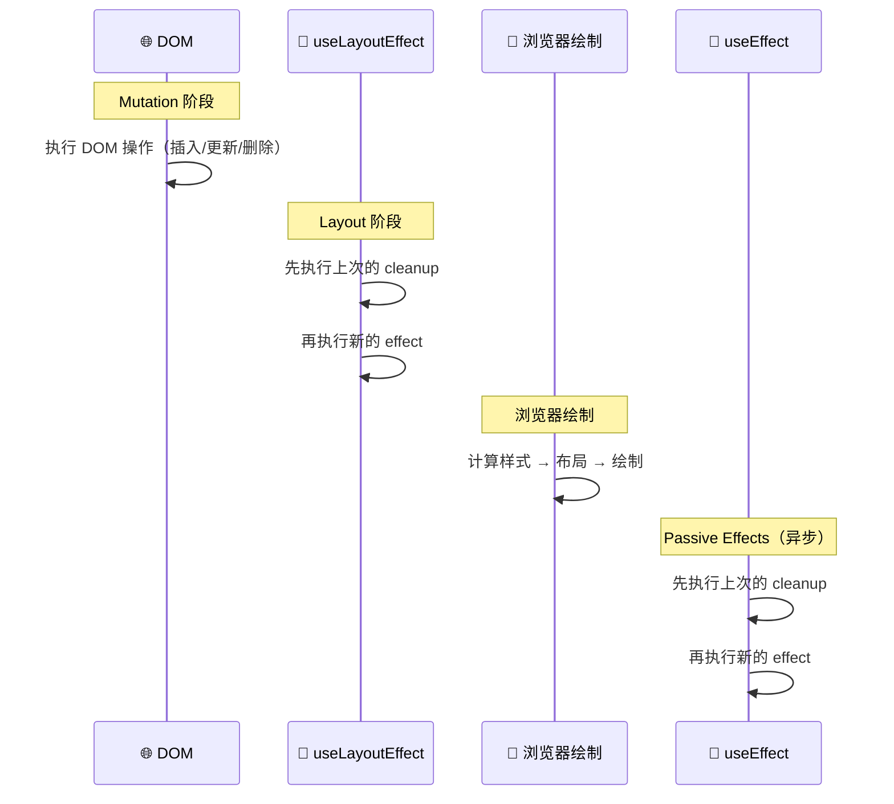

# 🎬 第八章：渲染与提交流程

> 本章将完整串联从 `setState` 到页面更新的全部流程，这是理解 React 工作原理的**最后一块拼图**。

## 🗺️ 全局视角

React 的一次更新分为三个大阶段：



| 阶段 | 特点 | 做什么 |
|------|------|--------|
| **触发（Schedule）** | 随时发生 | 创建更新，确定优先级，安排调度 |
| **渲染（Render）** | ⚡ 可中断 | 构建 Fiber 树，执行 Diff，标记副作用 |
| **提交（Commit）** | 🔒 不可中断 | 操作 DOM，执行 Effect，同步完成 |

> 🌰 **比喻 - 装修房子**：
> - **触发** = 业主决定要装修，找装修公司下单
> - **渲染** = 设计师画图纸，比较新旧方案，标注要改哪些地方（可以反复修改）
> - **提交** = 工人按图纸施工，一次性改完（施工中不能停）

## 🔔 触发阶段（Schedule Phase）

### 触发更新的方式

```javascript
// 1️⃣ 首次渲染
const root = ReactDOM.createRoot(document.getElementById('root'));
root.render(<App />);

// 2️⃣ setState / useState
const [count, setCount] = useState(0);
setCount(1);          // 触发更新
setCount(c => c + 1); // 或者传函数

// 3️⃣ forceUpdate（Class 组件）
this.forceUpdate();

// 4️⃣ 外部状态变化
useSyncExternalStore(subscribe, getSnapshot);
```

### 更新调度流程

```javascript
// 简化自 packages/react-reconciler/src/ReactFiberWorkLoop.js

function scheduleUpdateOnFiber(fiber, lane) {
  // 1️⃣ 从触发更新的 Fiber 向上冒泡，标记优先级
  const root = markUpdateLaneFromFiberToRoot(fiber, lane);
  
  // 2️⃣ 在 root 上记录有待处理的 lane
  markRootUpdated(root, lane);
  
  // 3️⃣ 决定如何调度
  ensureRootIsScheduled(root);
}

function ensureRootIsScheduled(root) {
  // 获取最高优先级的待处理 lane
  const nextLanes = getNextLanes(root, NoLanes);
  
  if (nextLanes === NoLanes) {
    return;  // 没有待处理的更新
  }
  
  // 根据 lane 决定调度方式
  const newCallbackPriority = getHighestPriorityLane(nextLanes);
  
  if (newCallbackPriority === SyncLane) {
    // 同步更新：微任务中执行
    scheduleMicrotask(flushSyncWorkOnAllRoots);
  } else {
    // 并发更新：通过 Scheduler 调度
    const schedulerPriority = lanesToSchedulerPriority(newCallbackPriority);
    const newCallbackNode = scheduleCallback(
      schedulerPriority,
      performWorkOnRoot.bind(null, root)
    );
  }
}
```



## 🔄 渲染阶段（Render Phase）

渲染阶段的核心是**构建 workInProgress Fiber 树**，不会操作 DOM。

> 📂 **核心文件**：`packages/react-reconciler/src/ReactFiberWorkLoop.js`

### 入口：performWorkOnRoot

```javascript
function performWorkOnRoot(root, lanes) {
  if (shouldTimeSlice) {
    // ⚡ 并发模式：可中断
    workLoopConcurrent();
  } else {
    // 🔒 同步模式：不可中断
    workLoopSync();
  }
}

// 同步工作循环
function workLoopSync() {
  while (workInProgress !== null) {
    performUnitOfWork(workInProgress);
  }
}

// 并发工作循环（关键区别：多了 shouldYield 检查）
function workLoopConcurrent() {
  while (workInProgress !== null && !shouldYield()) {
    performUnitOfWork(workInProgress);
    //                          ☝️ 每处理一个 Fiber，检查是否要让出
  }
}
```

### 核心循环：performUnitOfWork



### beginWork 详解

不同类型的组件有不同的处理方式：

```javascript
function beginWork(current, workInProgress, renderLanes) {
  switch (workInProgress.tag) {
    case FunctionComponent: {
      // 📦 函数组件：调用组件函数，执行 Hooks
      const Component = workInProgress.type;
      const nextChildren = renderWithHooks(current, workInProgress, Component, props);
      reconcileChildren(current, workInProgress, nextChildren, renderLanes);
      return workInProgress.child;
    }
    
    case ClassComponent: {
      // 📦 类组件：调用 render 方法
      const instance = workInProgress.stateNode;
      const nextChildren = instance.render();
      reconcileChildren(current, workInProgress, nextChildren, renderLanes);
      return workInProgress.child;
    }
    
    case HostComponent: {
      // 🏷️ 原生 DOM 元素：直接协调子节点
      const nextChildren = workInProgress.pendingProps.children;
      reconcileChildren(current, workInProgress, nextChildren, renderLanes);
      return workInProgress.child;
    }
    
    case HostText: {
      // 📝 文本节点：没有子节点，直接返回 null
      return null;
    }
  }
}
```

### completeWork 详解

```javascript
function completeWork(current, workInProgress, renderLanes) {
  switch (workInProgress.tag) {
    case HostComponent: {
      const type = workInProgress.type;  // 'div', 'span' 等
      
      if (current !== null && workInProgress.stateNode != null) {
        // 🔄 更新：对比新旧 props
        const oldProps = current.memoizedProps;
        const newProps = workInProgress.pendingProps;
        
        // 找出需要更新的属性
        const updatePayload = diffProperties(oldProps, newProps);
        if (updatePayload) {
          workInProgress.flags |= Update;
          workInProgress.updateQueue = updatePayload;
        }
      } else {
        // 🆕 首次渲染：创建 DOM 实例
        const instance = document.createElement(type);
        
        // 将子 DOM 节点挂载到新创建的 DOM 上
        appendAllChildren(instance, workInProgress);
        
        // 设置 DOM 属性（className, style 等）
        setInitialProperties(instance, type, newProps);
        
        // 保存 DOM 引用
        workInProgress.stateNode = instance;
      }
      
      // 冒泡子树的副作用标记
      bubbleProperties(workInProgress);
      return null;
    }
  }
}
```

### 渲染阶段的产出

渲染阶段结束后，我们得到：



## 📤 提交阶段（Commit Phase）

渲染阶段完成后，React 进入**不可中断的**提交阶段，将变更应用到真实 DOM。

> 📂 **核心文件**：`packages/react-reconciler/src/ReactFiberCommitWork.js`

提交阶段分为**三个子阶段**：



### 子阶段一：Before Mutation（变更前）

```javascript
function commitBeforeMutationEffects(root, finishedWork) {
  // 遍历有 BeforeMutationMask 标记的 Fiber
  while (nextEffect !== null) {
    const fiber = nextEffect;
    
    if (fiber.tag === ClassComponent) {
      // 调用 getSnapshotBeforeUpdate 生命周期
      // 这是在 DOM 变更前的最后一次读取 DOM 的机会
      const snapshot = fiber.stateNode.getSnapshotBeforeUpdate(
        fiber.memoizedProps,
        fiber.memoizedState
      );
    }
    
    nextEffect = nextEffect.nextEffect;
  }
}
```

> 💡 `getSnapshotBeforeUpdate` 用于在 DOM 变更前捕获信息（如滚动位置），DOM 变更后可以恢复。

### 子阶段二：Mutation（DOM 变更）

这是**真正操作 DOM** 的阶段：

```javascript
function commitMutationEffects(root, finishedWork) {
  while (nextEffect !== null) {
    const fiber = nextEffect;
    const flags = fiber.flags;
    
    // 1️⃣ 处理子节点删除
    if (flags & ChildDeletion) {
      commitDeletionEffects(root, returnFiber, fiber.deletions);
    }
    
    // 2️⃣ 处理 DOM 操作
    if (flags & Placement) {
      // 📌 插入新节点
      commitPlacement(fiber);
    }
    
    if (flags & Update) {
      // 🔄 更新已有节点的属性
      commitWork(current, fiber);
    }
    
    nextEffect = nextEffect.nextEffect;
  }
}

// 插入操作
function commitPlacement(finishedWork) {
  // 找到最近的真实 DOM 父节点
  const parentFiber = getHostParentFiber(finishedWork);
  const parentDOM = parentFiber.stateNode;
  
  // 找到插入位置（兄弟节点之前）
  const before = getHostSibling(finishedWork);
  
  // 执行 DOM 操作
  if (before) {
    parentDOM.insertBefore(finishedWork.stateNode, before);
  } else {
    parentDOM.appendChild(finishedWork.stateNode);
  }
}

// 更新操作
function commitWork(current, finishedWork) {
  if (finishedWork.tag === HostComponent) {
    const updatePayload = finishedWork.updateQueue;
    // updatePayload 格式: ['className', 'new-class', 'style', {color: 'red'}]
    
    for (let i = 0; i < updatePayload.length; i += 2) {
      const propKey = updatePayload[i];
      const propValue = updatePayload[i + 1];
      
      if (propKey === 'style') {
        Object.assign(finishedWork.stateNode.style, propValue);
      } else if (propKey === 'children') {
        finishedWork.stateNode.textContent = propValue;
      } else {
        finishedWork.stateNode.setAttribute(propKey, propValue);
      }
    }
  }
}
```

### 关键时刻：切换 Current 树

在 Mutation 阶段完成后，Layout 阶段开始前：

```javascript
// 🔄 这一行代码完成了双缓冲的切换！
root.current = finishedWork;
// workInProgress 树变成了新的 current 树
```



### 子阶段三：Layout（变更后）

```javascript
function commitLayoutEffects(finishedWork, root) {
  while (nextEffect !== null) {
    const fiber = nextEffect;
    const flags = fiber.flags;
    
    // 1️⃣ 执行 useLayoutEffect 的回调
    if (flags & LayoutMask) {
      if (fiber.tag === FunctionComponent) {
        commitHookEffectListMount(HookLayout, fiber);
      }
      
      // 2️⃣ Class 组件：调用 componentDidMount / componentDidUpdate
      if (fiber.tag === ClassComponent) {
        const instance = fiber.stateNode;
        if (current === null) {
          instance.componentDidMount();
        } else {
          instance.componentDidUpdate(prevProps, prevState, snapshot);
        }
      }
    }
    
    // 3️⃣ 更新 ref
    if (flags & Ref) {
      commitAttachRef(fiber);
    }
    
    nextEffect = nextEffect.nextEffect;
  }
}
```

### Passive Effects（useEffect）

useEffect 不在 Commit 阶段同步执行，而是在**之后异步执行**：

```javascript
function commitRoot(root) {
  // 1. Before Mutation
  commitBeforeMutationEffects(root, finishedWork);
  
  // 2. Mutation（DOM 操作）
  commitMutationEffects(root, finishedWork);
  
  // 🔄 切换 current 树
  root.current = finishedWork;
  
  // 3. Layout（useLayoutEffect）
  commitLayoutEffects(finishedWork, root);
  
  // 4. 调度 Passive Effects（useEffect 异步执行）
  if (rootDoesHavePassiveEffects) {
    scheduleCallback(NormalPriority, () => {
      flushPassiveEffects();  // 异步执行 useEffect
    });
  }
}

function flushPassiveEffects() {
  // 1️⃣ 先执行所有 useEffect 的 cleanup（销毁函数）
  commitPassiveUnmountEffects(root.current);
  
  // 2️⃣ 再执行所有 useEffect 的 create（创建函数）
  commitPassiveMountEffects(root, root.current);
}
```

## 🎯 完整流程图

将所有阶段串联起来：



## 🌊 Effect 执行顺序总结



## 📝 本章小结

**核心要点**：
1. 🔔 **触发阶段**：创建更新、确定优先级、安排调度
2. 🔄 **渲染阶段**：可中断，构建 workInProgress 树，执行 Diff，标记副作用
3. 📤 **提交阶段**：不可中断，分为 Before Mutation → Mutation → Layout 三个子阶段
4. 🔀 **current 树切换**发生在 Mutation 之后、Layout 之前
5. 🌊 `useEffect` 在提交阶段之后**异步**执行
6. 📐 `useLayoutEffect` 在提交阶段中**同步**执行（会阻塞浏览器绘制）

---

📖 **下一章**：[并发模式 →](./09-concurrent-mode.md)

> 在下一章，我们将深入 React 的并发特性，理解 Transition、Suspense 等高级功能。
