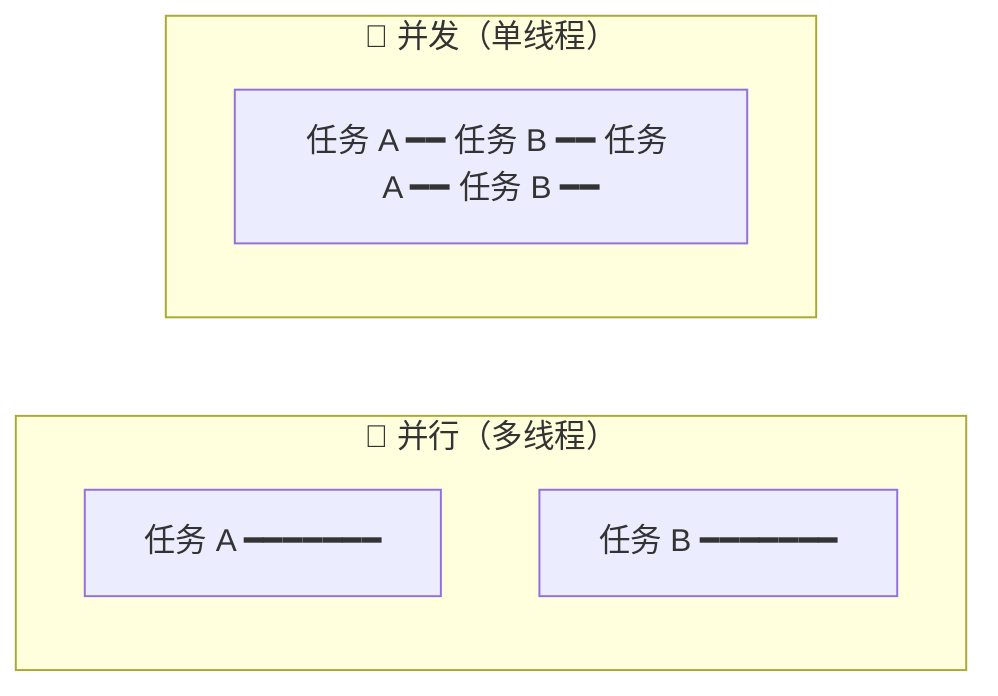
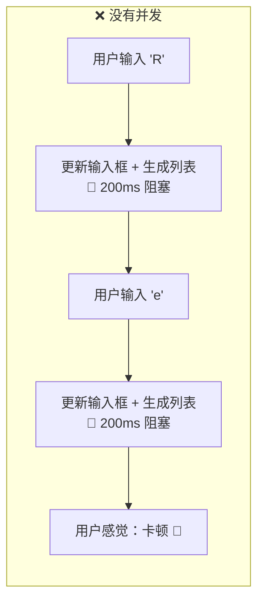
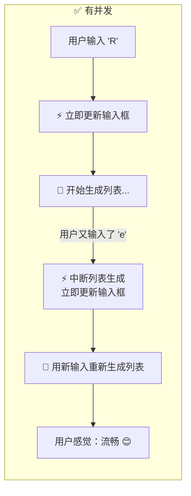
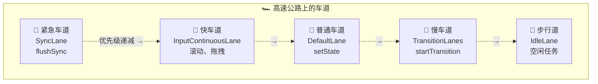
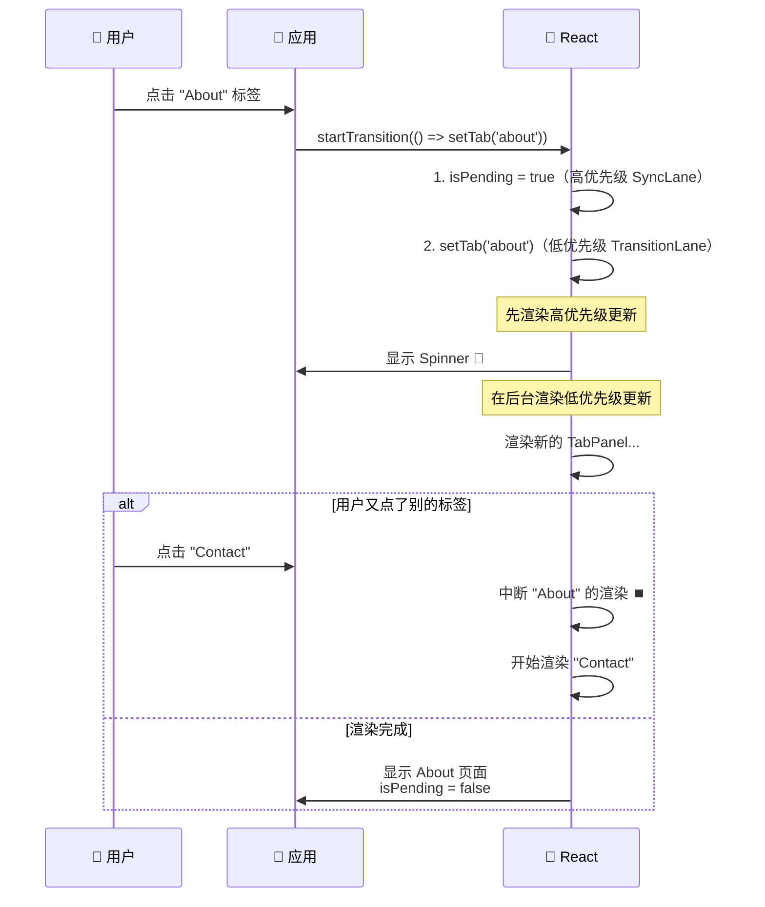
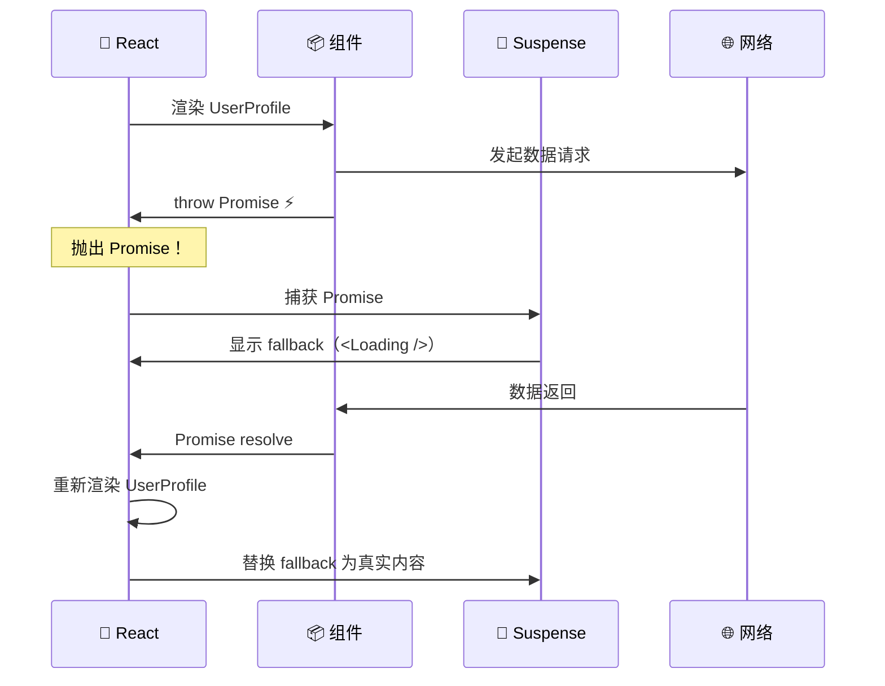
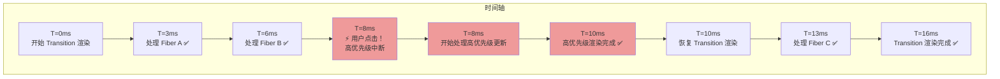
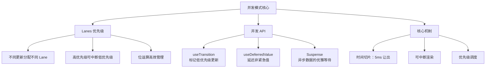

# 🚀 第九章：并发模式（Concurrent Mode）

> 并发模式是 React 18+ 的核心特性，让 React 能够同时处理多个更新，保证用户体验的流畅性。

## 🤔 什么是并发？

先区分两个概念：

- **并行（Parallel）**：多件事**同时**发生（需要多个 CPU 核心）
- **并发（Concurrent）**：多件事**交替**进行（一个核心快速切换任务）



> 🌰 **比喻**：你在做两道菜。**并行**就是你有两个灶台，两道菜同时做。**并发**就是你只有一个灶台，先炒一会青菜，然后去煮一会汤，再回来继续炒青菜 —— 交替进行，但最终两道菜都做好了。

React 运行在浏览器的**单线程**上，所以它采用的是**并发**模式。

## ❓ 为什么需要并发？

### 没有并发的问题

```jsx
function App() {
  const [input, setInput] = useState('');
  const [list, setList] = useState([]);

  function handleChange(e) {
    setInput(e.target.value);      // 更新输入框
    setList(generateBigList(e.target.value));  // 生成大量列表（耗时 200ms）
  }

  return (
    <div>
      <input value={input} onChange={handleChange} />
      <List items={list} />
    </div>
  );
}
```



### 有并发的解决方案

```jsx
function App() {
  const [input, setInput] = useState('');
  const [list, setList] = useState([]);

  function handleChange(e) {
    setInput(e.target.value);      // ⚡ 高优先级：立即更新

    startTransition(() => {
      setList(generateBigList(e.target.value));  // 🐢 低优先级：可以被中断
    });
  }

  return (
    <div>
      <input value={input} onChange={handleChange} />
      <List items={list} />
    </div>
  );
}
```



## 🛤️ Lanes —— 并发的基础

> 📂 **源码位置**：`packages/react-reconciler/src/ReactFiberLane.js`

Lanes（车道）是 React 并发模式的**优先级模型**。不同的更新被分配到不同的 Lane：

```javascript
// 每个 Lane 是一个二进制位
const SyncLane           = 0b0000000000000000000000000000010;
const InputContinuousLane= 0b0000000000000000000000000001000;
const DefaultLane        = 0b0000000000000000000000000100000;
const TransitionLane1    = 0b0000000000000000000000100000000;
const TransitionLane2    = 0b0000000000000000000001000000000;
// ... 共 16 条 Transition Lane
const IdleLane           = 0b0010000000000000000000000000000;
const OffscreenLane      = 0b0100000000000000000000000000000;
```



### Lane 的批处理

多个相同优先级的更新可以合并处理：

```javascript
// 位运算合并多个 Lane
const mergedLanes = TransitionLane1 | TransitionLane2;
// 0b0000000000000000000000100000000 | 0b0000000000000000000001000000000
// = 0b0000000000000000000001100000000

// 检查是否包含某个 Lane
function includesTransitionLane(lanes) {
  return (lanes & TransitionLanes) !== NoLanes;
}

// 获取最高优先级的 Lane
function getHighestPriorityLane(lanes) {
  return lanes & -lanes;  // 取最低位的 1
}
```

### 更新如何被分配 Lane

```javascript
function requestUpdateLane(fiber) {
  // 1. 如果在 Transition 中，使用 TransitionLane
  if (currentEventTransitionLane !== NoLane) {
    return currentEventTransitionLane;
  }
  
  // 2. 根据当前执行环境确定
  const updateLane = getCurrentUpdatePriority();
  if (updateLane !== NoLane) {
    return updateLane;
  }
  
  // 3. 根据事件类型确定
  const eventLane = getCurrentEventPriority();
  return eventLane;
}

// 不同事件对应不同优先级
function getEventPriority(domEventName) {
  switch (domEventName) {
    case 'click':
    case 'keydown':
    case 'keyup':
      return DiscreteEventPriority;   // → SyncLane
      
    case 'scroll':
    case 'mousemove':
    case 'drag':
      return ContinuousEventPriority; // → InputContinuousLane
      
    default:
      return DefaultEventPriority;    // → DefaultLane
  }
}
```

## 🔄 useTransition —— 标记低优先级更新

> 📂 **源码位置**：`packages/react-reconciler/src/ReactFiberHooks.js`

```javascript
function mountTransition() {
  const [isPending, setPending] = mountState(false);
  
  const start = (callback) => {
    setPending(true);
    
    // 🔑 关键：在 Transition 上下文中执行回调
    const prevTransition = ReactSharedInternals.T;
    ReactSharedInternals.T = {};  // 标记进入 Transition
    
    try {
      setPending(false);
      callback();  // callback 中的 setState 会被标记为 TransitionLane
    } finally {
      ReactSharedInternals.T = prevTransition;
    }
  };
  
  return [isPending, start];
}
```

### 使用方式

```jsx
function TabContainer() {
  const [isPending, startTransition] = useTransition();
  const [tab, setTab] = useState('home');

  function selectTab(nextTab) {
    startTransition(() => {
      setTab(nextTab);  // 这个更新是 TransitionLane（低优先级）
    });
  }

  return (
    <div>
      <TabBar 
        tabs={['home', 'about', 'contact']} 
        onSelect={selectTab} 
      />
      {isPending ? <Spinner /> : <TabPanel tab={tab} />}
    </div>
  );
}
```



## ⏳ useDeferredValue —— 延迟值

```javascript
function mountDeferredValue(value) {
  const hook = mountWorkInProgressHook();
  hook.memoizedState = value;
  return value;
}

function updateDeferredValue(value) {
  const hook = updateWorkInProgressHook();
  const prevValue = hook.memoizedState;
  
  // 如果值没变，直接返回
  if (Object.is(value, prevValue)) {
    return value;
  }
  
  // 如果当前正在进行高优先级渲染，返回旧值
  // 然后在低优先级的渲染中返回新值
  if (isCurrentTreeHiddenPriority()) {
    hook.memoizedState = value;
    return value;
  } else {
    // 标记需要一个低优先级的重渲染
    const deferredLane = requestDeferredLane();
    markSkippedUpdateLanes(deferredLane);
    hook.memoizedState = prevValue;  // 先返回旧值
    return prevValue;
  }
}
```

### 使用场景

```jsx
function SearchResults({ query }) {
  // query 改变时，deferredQuery 会「延迟」更新
  const deferredQuery = useDeferredValue(query);
  
  // 用 deferredQuery 做耗时计算
  const results = useMemo(() => 
    search(deferredQuery), // 只在 deferredQuery 变化时重新搜索
    [deferredQuery]
  );
  
  // query !== deferredQuery 时，说明正在「过渡」
  const isStale = query !== deferredQuery;
  
  return (
    <div style={{ opacity: isStale ? 0.5 : 1 }}>
      {results.map(item => <Result key={item.id} item={item} />)}
    </div>
  );
}
```

## 🌊 Suspense —— 异步的优雅处理

Suspense 让组件可以「等待」异步数据，在等待期间显示 fallback：

```jsx
function App() {
  return (
    <Suspense fallback={<Loading />}>
      <UserProfile />  {/* 可能还在加载数据 */}
    </Suspense>
  );
}
```

### Suspense 的工作原理



### 源码中的 Suspense 处理

```javascript
// 在 beginWork 中处理 SuspenseComponent
function updateSuspenseComponent(current, workInProgress, renderLanes) {
  const nextProps = workInProgress.pendingProps;
  
  let showFallback = false;
  const didSuspend = (workInProgress.flags & DidCapture) !== NoFlags;
  
  if (didSuspend) {
    showFallback = true;
    workInProgress.flags &= ~DidCapture;  // 清除标记
  }
  
  if (showFallback) {
    // 渲染 fallback
    const fallbackChildren = nextProps.fallback;
    return mountSuspenseFallbackChildren(workInProgress, fallbackChildren, renderLanes);
  } else {
    // 渲染主内容
    const primaryChildren = nextProps.children;
    return mountSuspensePrimaryChildren(workInProgress, primaryChildren, renderLanes);
  }
}

// 当组件 throw Promise 时
function throwException(root, value, sourceFiber, renderLanes) {
  if (typeof value === 'object' && typeof value.then === 'function') {
    // 这是一个 Promise（Suspense 触发）
    const wakeable = value;
    
    // 找到最近的 Suspense 边界
    const suspenseBoundary = getNearestSuspenseBoundaryToCapture(sourceFiber);
    
    if (suspenseBoundary !== null) {
      // 标记 Suspense 需要显示 fallback
      suspenseBoundary.flags |= ShouldCapture;
      
      // 注册 Promise 的回调（resolve 后重新渲染）
      attachPingListener(root, wakeable, renderLanes);
    }
  }
}
```

## 🔄 并发渲染的中断与恢复

### 高优先级中断低优先级



```javascript
// 简化的中断逻辑
function workLoopConcurrent() {
  while (workInProgress !== null && !shouldYield()) {
    performUnitOfWork(workInProgress);
  }
  // shouldYield() 返回 true 时循环退出
  // workInProgress 保留了当前位置
  // 下次执行时从这里继续
}

function ensureRootIsScheduled(root) {
  const existingCallbackPriority = root.callbackPriority;
  const newCallbackPriority = getHighestPriorityLane(nextLanes);
  
  // 如果有更高优先级的更新来了
  if (newCallbackPriority > existingCallbackPriority) {
    // 取消当前正在执行的低优先级任务
    cancelCallback(existingCallbackNode);
    
    // 安排新的高优先级任务
    const newCallbackNode = scheduleCallback(
      higherPriority,
      performWorkOnRoot.bind(null, root)
    );
    root.callbackNode = newCallbackNode;
    root.callbackPriority = newCallbackPriority;
  }
}
```

## 📝 本章小结



**核心要点**：
1. 🔄 并发 ≠ 并行，React 在单线程上通过**交替执行**实现并发
2. 🛤️ **Lanes** 模型提供精细的优先级控制，不同更新分配到不同车道
3. ⚡ `useTransition` 将更新标记为低优先级，不阻塞用户交互
4. ⏳ `useDeferredValue` 让值延迟更新，避免频繁重渲染
5. 🌊 `Suspense` 通过 throw Promise 机制，优雅处理异步加载
6. 🔀 高优先级更新可以**中断**低优先级更新的渲染

---

📖 **下一章**：[服务端组件（Server Components）→](./10-server-components.md)

> 在最后一章，我们将探索 React 最新的服务端组件技术，理解它如何改变前后端的协作方式。
