# 🌐 第十章：服务端组件（Server Components）

> React Server Components（RSC）是 React 最前沿的特性，它重新定义了前后端的协作方式。

## 🤔 为什么需要服务端组件？

传统的 React 应用（CSR，客户端渲染）有一些痛点：

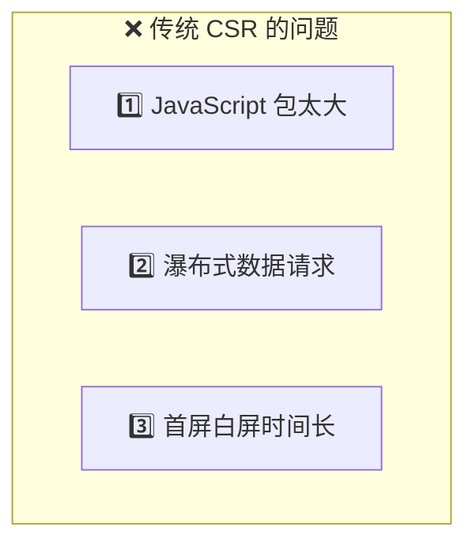

### 问题一：包太大

```jsx
// 这个组件用了一个 500KB 的 Markdown 渲染库
import MarkdownRenderer from 'huge-markdown-lib';  // 500KB！
import sanitize from 'sanitize-html';               // 200KB！

function BlogPost({ content }) {
  return <MarkdownRenderer>{sanitize(content)}</MarkdownRenderer>;
}

// 问题：这 700KB 的库都要下载到用户浏览器上
// 但其实 Markdown 渲染不需要交互，完全可以在服务端完成！
```

### 问题二：瀑布式请求

```jsx
// 客户端组件：数据请求是「瀑布式」的
function App() {
  const user = useData('/api/user');        // 第 1 次请求
  return <Profile user={user} />;
}

function Profile({ user }) {
  const posts = useData(`/api/posts/${user.id}`);  // 第 2 次请求（等第 1 次完成后才能发）
  return <PostList posts={posts} />;
}

function PostList({ posts }) {
  const comments = useData(`/api/comments?posts=${posts.map(p => p.id)}`);  // 第 3 次请求
  return /* ... */;
}
```

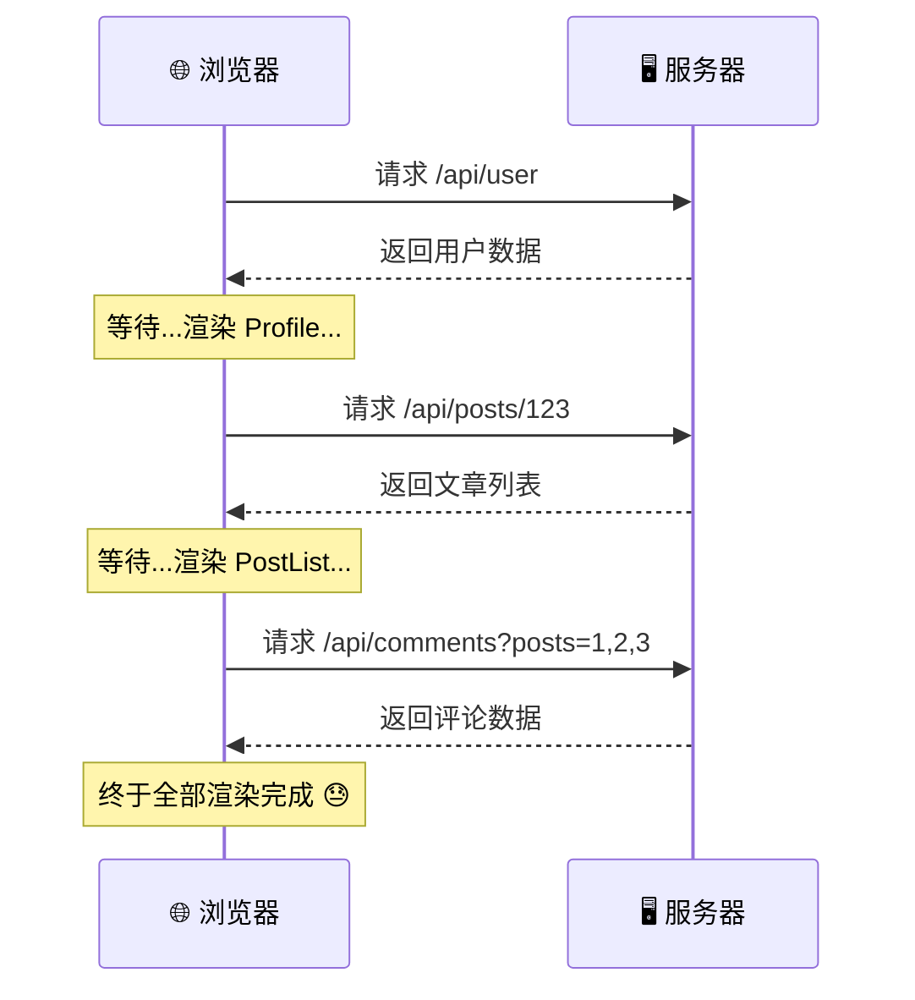

### 服务端组件的解决方案

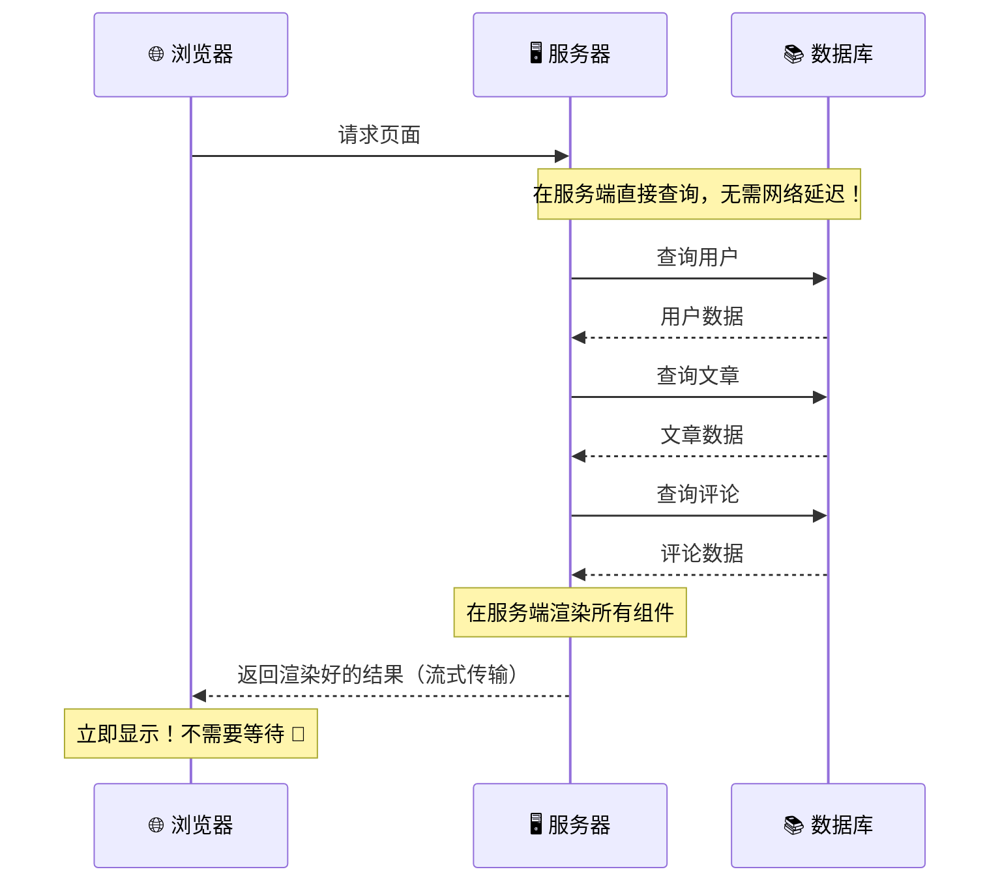

## 🏗️ 服务端组件 vs 客户端组件

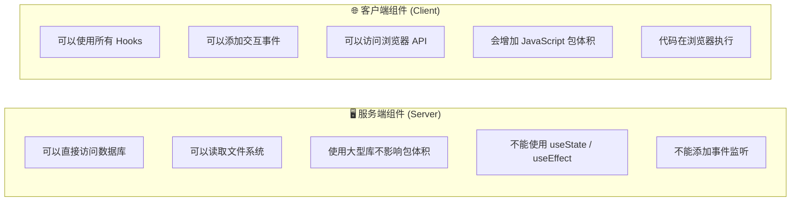

```jsx
// 🖥️ 服务端组件（默认，无 'use client' 指令）
// 在服务器上执行，不会发送到客户端
async function BlogPost({ id }) {
  // 可以直接查数据库！
  const post = await db.posts.findById(id);
  const content = await readFile(`./posts/${id}.md`);
  
  return (
    <article>
      <h1>{post.title}</h1>
      <MarkdownRenderer content={content} />  {/* 500KB 库不会到客户端 */}
      <LikeButton postId={id} />  {/* 这个需要交互，是客户端组件 */}
    </article>
  );
}

// 🌐 客户端组件（标记 'use client'）
'use client';

function LikeButton({ postId }) {
  const [liked, setLiked] = useState(false);
  
  return (
    <button onClick={() => setLiked(!liked)}>
      {liked ? '❤️' : '🤍'} 喜欢
    </button>
  );
}
```

> 🌰 **通俗比喻**：
> - **服务端组件** = 餐厅的后厨：准备食材、切菜、摆盘都在后厨完成，顾客看到的是做好的菜
> - **客户端组件** = 餐桌上的调料台：顾客自己加辣椒、醋（交互操作），需要放在餐桌上

## 📡 Flight 协议 —— RSC 的传输格式

服务端组件的渲染结果不是 HTML，而是通过 **Flight 协议** 传输的特殊格式。

> 📂 **源码位置**：
> - 服务端：`packages/react-server/src/`
> - 客户端：`packages/react-client/src/`
> - Webpack 集成：`packages/react-server-dom-webpack/`

### Flight 格式示例

```
0:["$","div",null,{"children":[
  ["$","h1",null,{"children":"Hello, World!"}],
  ["$","$L1",null,{"postId":42}]
]}]
1:I["./LikeButton.js","LikeButton"]
```

解读：
- `0:` — 根组件的序列化内容
- `"$"` — 表示这是一个 React Element
- `"$L1"` — 表示这是一个「惰性引用」，指向客户端组件
- `1:I[...]` — 客户端组件的模块引用

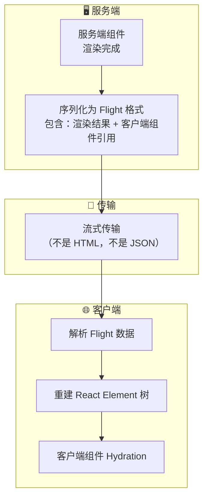

### 序列化过程

```javascript
// 简化自 packages/react-server/src/ReactFlightServer.js

function renderModelDestructive(request, task, model) {
  if (typeof model === 'object' && model !== null) {
    if (model.$$typeof === REACT_ELEMENT_TYPE) {
      const element = model;
      
      if (typeof element.type === 'function') {
        // 🖥️ 服务端组件：直接调用函数，递归序列化结果
        const result = element.type(element.props);
        return renderModelDestructive(request, task, result);
      }
      
      if (typeof element.type === 'string') {
        // 🏷️ 原生 DOM 元素：序列化为 ["$", "div", key, props]
        return ['$', element.type, element.key, processProps(element.props)];
      }
      
      if (isClientReference(element.type)) {
        // 🌐 客户端组件：序列化为引用标记
        const clientRef = registerClientReference(element.type);
        return ['$', `$L${clientRef.id}`, element.key, element.props];
      }
    }
  }
  
  // 基础类型直接返回
  return model;
}
```

## 🌊 流式渲染

服务端组件支持**流式传输**，而不是等所有组件都渲染完再发送：

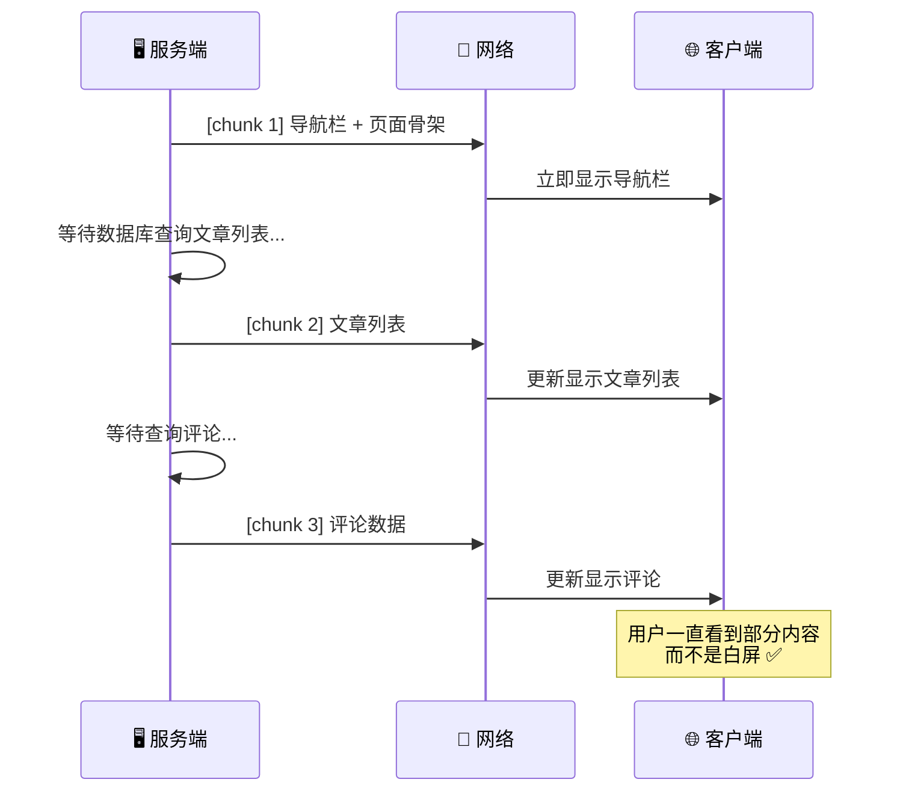

### 流式传输与 Suspense 的配合

```jsx
// 服务端组件
async function Page() {
  return (
    <div>
      <Header />  {/* 立即渲染 */}
      
      <Suspense fallback={<PostsSkeleton />}>
        <Posts />  {/* 异步，等数据库 */}
      </Suspense>
      
      <Suspense fallback={<CommentsSkeleton />}>
        <Comments />  {/* 异步，等数据库 */}
      </Suspense>
    </div>
  );
}

async function Posts() {
  const posts = await db.posts.findAll();  // 可能需要 200ms
  return <PostList posts={posts} />;
}

async function Comments() {
  const comments = await db.comments.findAll();  // 可能需要 500ms
  return <CommentList comments={comments} />;
}
```

```mermaid
gantt
    title 流式渲染时间线
    dateFormat X
    axisFormat %L

    section 服务端渲染
    Header (立即完成)           :active, 0, 5
    Posts (查询数据库)           :crit, 5, 200
    Comments (查询数据库)        :crit, 5, 500

    section 客户端显示
    Header 展示                 :active, 10, 15
    Posts 骨架屏                :15, 210
    Posts 内容替换               :milestone, 210, 210
    Comments 骨架屏             :15, 510
    Comments 内容替换            :milestone, 510, 510
```

## 🔧 'use client' 和 'use server' 指令

这两个指令定义了**服务端和客户端的边界**：

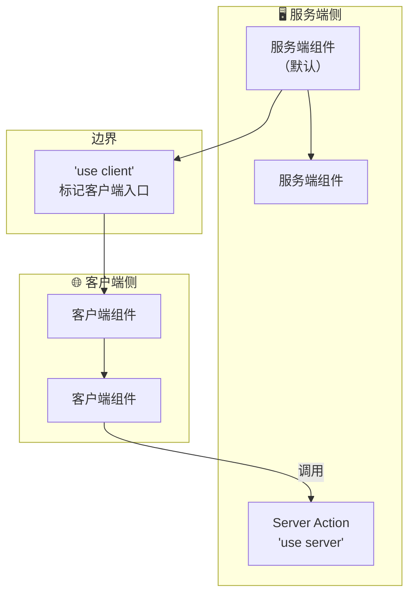

### 'use server' —— Server Actions

```jsx
// 🖥️ Server Action：服务端函数，客户端可以直接调用
'use server';

async function addToCart(productId) {
  const cart = await db.cart.add(productId);
  return cart;
}

// 🌐 客户端组件中使用
'use client';

function AddToCartButton({ productId }) {
  const [isPending, startTransition] = useTransition();
  
  return (
    <button onClick={() => {
      startTransition(async () => {
        await addToCart(productId);  // 直接调用服务端函数！
      });
    }}>
      {isPending ? '添加中...' : '加入购物车'}
    </button>
  );
}
```

> 🌰 **比喻**：`'use server'` 就像一个**遥控器按钮**。你在客厅（客户端）按下按钮，空调（服务端）就开始工作。你不需要走到空调旁边（发 HTTP 请求），遥控器帮你搞定了。

## 📂 源码中的包结构

```
packages/
├── react-server/                    # 🖥️ 服务端组件渲染核心
│   └── src/
│       ├── ReactFlightServer.js     # Flight 协议 - 服务端
│       └── ReactFizzServer.js       # HTML 流式渲染
│
├── react-client/                    # 🌐 客户端消费 Flight 数据
│   └── src/
│       └── ReactFlightClient.js     # Flight 协议 - 客户端
│
├── react-server-dom-webpack/        # 📦 Webpack 集成
│   └── src/
│       ├── server/                  # Webpack 环境的服务端
│       └── client/                  # Webpack 环境的客户端
│
├── react-server-dom-esm/            # ESM 环境集成
├── react-server-dom-parcel/         # Parcel 集成
└── react-server-dom-turbopack/      # Turbopack 集成
```

## 🔑 Server Components 的约束

### 服务端组件不能做的事

```jsx
// ❌ 不能使用 Hooks
function ServerComp() {
  const [state, setState] = useState(0);  // ❌ 报错！
  useEffect(() => { ... });               // ❌ 报错！
  return <div>{state}</div>;
}

// ❌ 不能使用浏览器 API
function ServerComp() {
  const width = window.innerWidth;  // ❌ 服务端没有 window！
  return <div style={{ width }} />;
}

// ❌ 不能添加事件处理
function ServerComp() {
  return <button onClick={() => alert('hi')}>Click</button>;  // ❌ 报错！
}
```

### 服务端组件能做的事

```jsx
// ✅ 直接访问数据库
async function ServerComp() {
  const data = await db.query('SELECT * FROM users');
  return <UserList users={data} />;
}

// ✅ 读取文件系统
async function ServerComp() {
  const content = await fs.readFile('./data.json', 'utf-8');
  return <pre>{content}</pre>;
}

// ✅ 使用服务端专属的库（不增加客户端包体积）
import { parse } from 'heavy-parser';  // 2MB 的库，不会到客户端
```

## 🗺️ 完整的 RSC 数据流

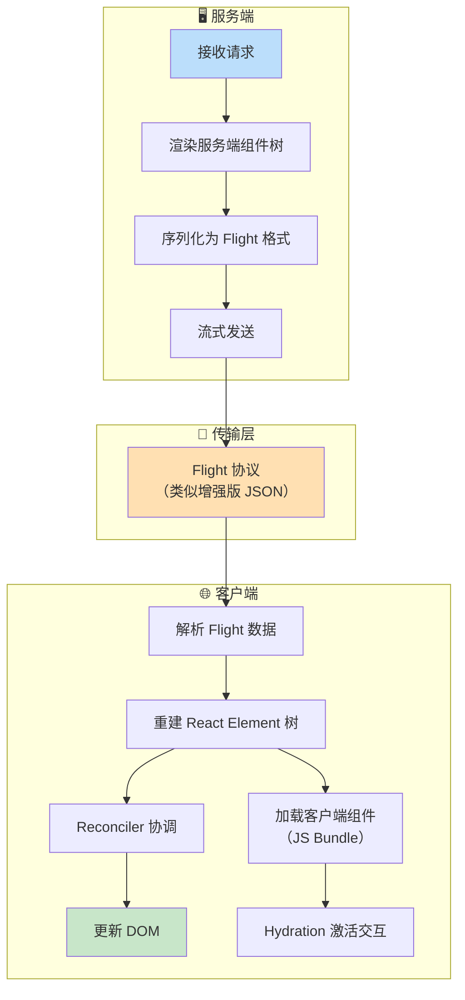

## 📝 本章小结

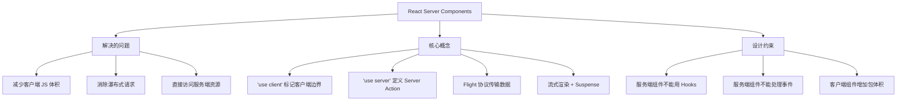

**核心要点**：
1. 🎯 服务端组件在**服务器上**渲染，不增加客户端 JavaScript 体积
2. 📡 **Flight 协议**是专门为 RSC 设计的序列化格式
3. 🌊 **流式渲染**配合 Suspense，实现渐进式内容展示
4. 🔗 `'use client'` 和 `'use server'` 定义了前后端边界
5. ⚡ **Server Actions** 让客户端可以直接调用服务端函数

---

## 🎉 恭喜你完成了全部教程！

你已经从 JSX 的编译原理出发，一路深入到 Fiber 架构、Diff 算法、调度器、Hooks、事件系统、渲染流程、并发模式和服务端组件。

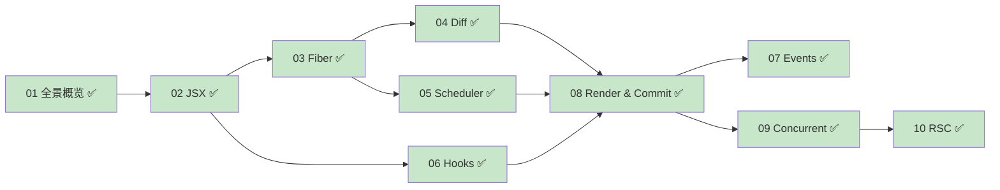

### 🚀 接下来可以做什么？

1. **调试源码**：在本仓库中加断点，运行测试用例，观察执行流程
2. **参与贡献**：阅读 [CONTRIBUTING.md](../CONTRIBUTING.md)，尝试修复一些标记为 `good first issue` 的问题
3. **深入细节**：每个章节都有标注的源码路径，可以顺着这些路径深入阅读
4. **关注更新**：React 仍在积极开发中，持续关注新特性

> 📚 回到 [教程首页](./README.md)
