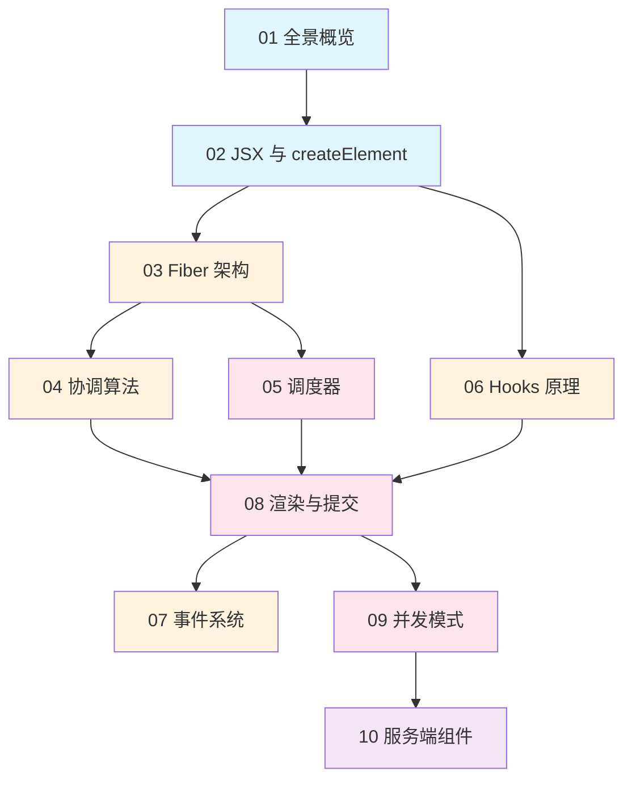
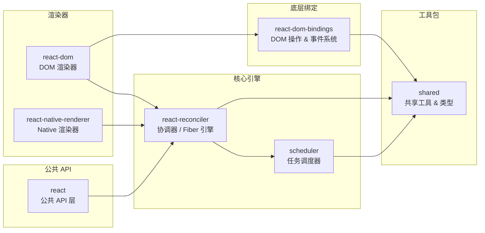

# 📚 React 源码深度学习教程

> 🎯 由浅入深，带你读懂 React 源码的每一个核心模块

## 🌟 教程简介

本教程基于 React v19.x 源码（本仓库），从**基础概念**到**底层实现**，系统性地拆解 React 的核心架构。无论你是想理解 React 的工作原理、提升前端能力，还是想参与 React 开源贡献，这份教程都将成为你的指南。

## 📖 目录

| 序号 | 章节 | 难度 | 说明 |
|:---:|------|:---:|------|
| 01 | [🏗️ React 源码全景概览](./01-overview.md) | ⭐ | 仓库结构、核心包、构建系统总览 |
| 02 | [✨ JSX 与 createElement](./02-jsx-and-createElement.md) | ⭐⭐ | JSX 编译原理、虚拟 DOM 的诞生 |
| 03 | [🌳 Fiber 架构深度解析](./03-fiber-architecture.md) | ⭐⭐⭐ | Fiber 数据结构、双缓冲树、工作循环 |
| 04 | [🔄 协调算法（Reconciliation）](./04-reconciliation.md) | ⭐⭐⭐ | Diff 算法、beginWork 与 completeWork |
| 05 | [⏰ 调度器（Scheduler）原理](./05-scheduler.md) | ⭐⭐⭐⭐ | 优先级调度、时间切片、任务队列 |
| 06 | [🪝 Hooks 实现原理](./06-hooks.md) | ⭐⭐⭐ | useState/useEffect 的底层机制 |
| 07 | [🎯 事件系统](./07-event-system.md) | ⭐⭐⭐ | 合成事件、事件委托、事件分发 |
| 08 | [🎬 渲染与提交流程](./08-render-and-commit.md) | ⭐⭐⭐⭐ | Render 阶段与 Commit 阶段的完整流程 |
| 09 | [🚀 并发模式（Concurrent Mode）](./09-concurrent-mode.md) | ⭐⭐⭐⭐ | Lanes 优先级、Transition、Suspense |
| 10 | [🌐 服务端组件（Server Components）](./10-server-components.md) | ⭐⭐⭐⭐⭐ | RSC 协议、流式渲染、Flight 协议 |

## 🗺️ 学习路线图



## 📁 仓库核心包关系图



## 💡 学习建议

1. **循序渐进**：按照章节顺序学习，每章都基于前面的知识
2. **对照源码**：每章都会标注对应的源码文件路径，建议对照阅读
3. **动手调试**：克隆本仓库，尝试在源码中加 `console.log` 观察执行流程
4. **画图理解**：遇到复杂的数据结构和流程，动手画图帮助理解
5. **反复阅读**：React 源码复杂度较高，不要期望一遍就能完全理解

## 🔧 环境准备

```bash
# 克隆仓库
git clone https://github.com/facebook/react.git
cd react

# 安装依赖
yarn install

# 构建（生成可调试的开发版本）
yarn build

# 运行测试
yarn test
```

## 📌 约定说明

- 📂 **文件路径**：所有路径均相对于仓库根目录
- 🔗 **源码引用**：`packages/react-reconciler/src/ReactFiber.js` 表示对应文件
- 💬 **中英对照**：核心概念会标注英文原文，如「协调（Reconciliation）」
- ⚡ **版本说明**：基于 React v19.x 源码分析

---

> 🎉 准备好了吗？让我们从 [第一章：React 源码全景概览](./01-overview.md) 开始吧！
